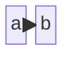

# CP2K Documentation

These are the source of the [CP2K manual](https://manual.cp2k.org/trunk). They are published daily
by [this script](../tools/docker/scripts/test_manual.sh).

To build a local version of the manual perform the following steps:

1. Create and activate a [virtual Python environment](https://docs.python.org/3/tutorial/venv.html):

   ```
   python3 -m venv ../docs_venv
   source ../docs_venv/bin/activate
   ```

1. Install the required Python packages:

   ```
   pip3 install -r ./requirements.txt
   ```

1. (optional) Build a CP2K binary and use it to generate the `cp2k_input.xml` file:

   ```
   ../exe/local/cp2k.psmp --xml
   ```

1. (optional) Generate Markdown pages from the `cp2k_input.xml` file:

   ```
   ./generate_input_reference.py ./cp2k_input.xml
   ```

1. Run Sphinx:

   ```
   make html
   ```

1. Browse the HTML output in the `_build/html` directory.

> \[!TIP\]
>
> While the first invocation of Sphinx can be quite slow, subsequent builds are significantly faster
> thanks to its doctree cache. Nevertheless, a build with the full input reference can take several
> minutes and requires a lot of memory. So for development it's advisable to build without the input
> reference. To check cross-references one can generate the input reference and then remove all
> pages except the relevant ones.

______________________________________________________________________

# Syntax Cheat Sheet

The CP2K manual uses Sphinx with the [MyST parser](https://myst-parser.readthedocs.io) for Markdown
support. The following gives a quick overview of the syntax:

## Headings

```
# A first-level heading

## A second-level heading

### A third-level heading
```

## Basic Text Formatting

```
**bold text**

_italic text_

~~strikethrough text~~

`inline code`
```

For a all typography options see the
[MyST documentation](https://myst-parser.readthedocs.io/en/latest/syntax/typography.html).

## Links

- Acronym: `` {term}`ADMM` ``
- Publication: `[](#Wilhelm2018)`
- Other page: `[](../properties/optical/tddft)`
- Input section: `[FORCE_EVAL](#CP2K_INPUT.FORCE_EVAL)`
- Input keyword: `[STRESS_TENSOR](#CP2K_INPUT.FORCE_EVAL.STRESS_TENSOR)`
- External URL: `<https://www.gromacs.org>`
- External URL with label:
  `[click here](https://github.com/cp2k/cp2k-examples/blob/master/qm_mm/Protein.pdb)`

## Lists

```
1. First enumerated item
1. Second enumerated item


- A bullet point
- Another bullet point
```

## Tables

```
| foo | bar |
| --- | --- |
| baz | bim |
```

For a all table options see the
[MyST documentation](https://myst-parser.readthedocs.io/en/latest/syntax/tables.html).

## Math

```
Inline math: $A_{ia,jb}$.

Math block:
$$ \begin{align}
    A_{ia,jb} &= (\varepsilon_a^{GW}-\varepsilon_i^{GW})\delta_{ij}\delta_{ab}
    B_{ia,jb} &= 2 v_{ia,bj} - W_{ib,aj} \quad .
\end{align} $$
```

See also the
[MyST](https://myst-parser.readthedocs.io/en/latest/syntax/optional.html#math-shortcuts) and
[MathJax](https://docs.mathjax.org/en/latest/input/tex/index.html) documentation.

## Notes and Warnings

````
```{note}
A note box.
```

```{warning}
A warning box.
```
````

For all available admonitions see the
[MyST documentation](https://myst-parser.readthedocs.io/en/latest/syntax/admonitions.html).

## Code Blocks

````
```python
for i in range(10):
  print("Hello World")
```
````

## Diagrams

````

````

For details see the [Mermaid documentation](https://mermaid.js.org/intro/) and also check out their
great [live editor](https://mermaid.live).

## Videos

````
```{youtube} teHVWKwBOTU
---
url_parameters: ?start=1500
align: center
privacy_mode:
---
```
````

The above example links to https://www.youtube.com/watch?v=teHVWKwBOTU at the 1500 seconds time
mark.
