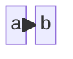

# CP2K Documentation

These are the source of the [CP2K manual](https://manual.cp2k.org/trunk). They are published daily
by [this script](../tools/docker/scripts/test_manual.sh).

To build a local version of the manual perform the following steps:

1. Create and activate a [virtual Python environment](https://docs.python.org/3/tutorial/venv.html):

   ```
   python3 -m venv ../docs_venv
   source ../docs_venv/bin/activate
   ```

1. Install the required Python packages:

   ```
   pip3 install -r ./requirements.txt
   ```

1. (optional) Build a CP2K binary and use it to generate the `cp2k_input.xml` file:

   ```
   ../install/bin/cp2k.psmp --xml
   ```

1. (optional) Generate Markdown pages from the `cp2k_input.xml` file:

   ```
   ./generate_input_reference.py ./cp2k_input.xml
   ```

1. Run Sphinx, followed by Pagefind to build the static search bundle:

   ```
   make html
   ```

1. Serve the HTML output locally (Pagefind needs HTTP, not `file://`):

   ```
   python3 -m http.server --bind 127.0.0.1 --directory _build/html 8000
   ```

   Open `http://127.0.0.1:8000/`. The sidebar search opens a Pagefind modal; `Ctrl+K` (`Cmd+K` on
   macOS) opens the same modal. Classic Sphinx search remains available.

> [!TIP]
>
> While the first invocation of Sphinx can be quite slow, subsequent builds are significantly faster
> thanks to its doctree cache. Nevertheless, a build with the full input reference can take several
> minutes and requires a lot of memory. So for development it's advisable to build without the input
> reference. To check cross-references one can generate the input reference and then remove all
> pages except the relevant ones.

## Static search

Pagefind is installed by `requirements.txt`, including its native indexing binary; no Node.js,
external search service, or deployment-side process is needed. `make html` runs the indexer only
after Sphinx has exited. A failed indexing command fails the build rather than silently publishing
an incomplete search bundle.

Publish the **entire** `_build/html` directory, including `pagefind/`. Assets and result URLs are
relative to the current manual version, so `/trunk/` and release directories have separate searches.
The first prototype does not merge indexes across versions. Deploy HTML and its matching search
bundle together; caches must allow the entry manifest and UI assets to refresh on updates.

If a publishing job invokes Sphinx directly instead of `make html`, run the indexer afterward, from
this directory:

```
make pagefind
# For an HTML output at /path/to/build/html:
make pagefind BUILDDIR=/path/to/build
```

`PAGEFIND` can be overridden to use a separately installed binary, and `PAGEFINDOPTS` passes extra
indexer options. The index settings are in `pagefind.yml`; commands should run from `docs/` so that
Pagefind reads this file. Other Sphinx targets, such as `linkcheck`, do not run Pagefind.

The search indexes only the document body, not sidebars, breadcrumbs, footers, generated keyword
lists, or edit links. Input-reference result titles include the section path. The Collection filter
separates input reference from other documentation. Named keyword rubrics are rendered as HTML
headings so Pagefind can link directly to the keyword, without adding Sphinx TOC entries or Python
domain objects. The anonymous inlined Libxc keywords retain their existing target policy; do not
expect unique keyword-level results for those in this first version.

For comparison, test `EPS_SCF`, `SCF EPS_SCF`, `ATOMIC_NUMBER`, `CELL_OPT CONSTRAINT`, `ADDED_MOS`,
and a prose query such as `geometry optimization`. Check keyword sub-result links as well as page
ranking. A full dotted input path and typo tolerance are not separately tuned in this prototype. A
missing or inaccessible search bundle leaves the original Sphinx search form available.

______________________________________________________________________

# Syntax Cheat Sheet

The CP2K manual uses Sphinx with the [MyST parser](https://myst-parser.readthedocs.io) for Markdown
support. The following gives a quick overview of the syntax:

## Headings

```
# A first-level heading

## A second-level heading

### A third-level heading
```

## Basic Text Formatting

```
**bold text**

_italic text_ (alternatively, *italic text*)

~~strikethrough text~~

`inline code`
```

For a all typography options see the
[MyST documentation](https://myst-parser.readthedocs.io/en/latest/syntax/typography.html).

## Links

- Acronym: `` {term}`ADMM` ``
  - This requires adding the definition to the [acronyms.md](./acronyms.md) and is rendered as a
    link to the [acronyms page](https://manual.cp2k.org/trunk/acronyms.html)
- Publication: `[](#Wilhelm2018)`
  - This requires adding the citation to the [bibliography.F](../src/common/bibliography.F) and is
    rendered as a link to the [bibliography page](https://manual.cp2k.org/trunk/bibliography.html);
    ⚠️ always use the auto-generated key on the bibliography page for documentation, which may or
    may not match the name of the variable `key` passed to fortran `CALL add_reference(key=...)`
    invocations for source codes
- Another page: `[](../optical/tddft)`
  - Use the relative path, where the `.md` suffix for file extension can be specified or omitted
- Subsection in the current page: `[](#problems-and-solutions)`
- Subsection in another page: `[](../optical/tddft.md#periodic-systems)`
  - ⚠️ Also use the relative path, but the `.md` suffix must be present before the `#` sign, and
    only the first three levels of headings have these anchors auto-generated on the final page
    ready for use; see [](#cross-references) below for an alternative
- Input section: `[FORCE_EVAL](#CP2K_INPUT.FORCE_EVAL)`
  - This will also generate a "mentions" backlink in the input reference for the section
- Input keyword: `[STRESS_TENSOR](#CP2K_INPUT.FORCE_EVAL.STRESS_TENSOR)`
  - This will also highlight the keyword in the list and generate a "mentions" backlink following
    the description in the input reference
  - In case there is a name conflit, append `_SECTION` to the link to the section and keep the link
    to the keyword as-is: use `[POTENTIAL](#CP2K_INPUT.FORCE_EVAL.SUBSYS.KIND.POTENTIAL_SECTION)`
    for the section `&POTENTIAL` and `[POTENTIAL](#CP2K_INPUT.FORCE_EVAL.SUBSYS.KIND.POTENTIAL)` for
    the keyword `POTENTIAL`
- External URL: `<https://www.gromacs.org>`
- External URL with label:
  `[click here](https://github.com/cp2k/cp2k-examples/blob/master/qm_mm/Protein.pdb)`

## Lists

For a numbered list:

```
1. First enumerated item
1. Second enumerated item
1. And the third item
```

> [!NOTE]
>
> Every item uses `1.` intentionally in the markdown source file, and the formatting tool in the
> precommit check will apply this style if detected. The list will still be rendered with the
> intended numbers as indices on github and the final HTML documentation page, but there is no
> longer the need to track and edit the numbers manually. For more information, see `mdformat` docs
> on [ordered lists](https://mdformat.readthedocs.io/en/stable/users/style.html#ordered-lists).

For an unordered list:

```
- A bullet point
- Another bullet point
  - Indented bullet point
- Yet another bullet point
* An asterisk is also okay
```

When nesting levels of lists, watch out for indentations and newlines.

```
1. 3D periodicity
  - XYZ
1. 2D periodicity
  - XY
  - YZ
  - XZ
1. 1D periodicity
  - X
  - Y
  - Z
1. non-periodic
```

## Tables

```
| foo | bar |
| --- | --- |
| baz | bim |
```

For more table formatting options, see the
[MyST documentation](https://myst-parser.readthedocs.io/en/latest/syntax/tables.html).

## Math

```
Inline math: $A_{ia,jb}$.

Math block:
$$ \begin{align}
    A_{ia,jb} &= (\varepsilon_a^{GW}-\varepsilon_i^{GW})\delta_{ij}\delta_{ab}
    B_{ia,jb} &= 2 v_{ia,bj} - W_{ib,aj} \quad .
\end{align} $$
```

See also the
[MyST](https://myst-parser.readthedocs.io/en/latest/syntax/optional.html#math-shortcuts) and
[MathJax](https://docs.mathjax.org/en/latest/input/tex/index.html) documentation.

## Notes and Warnings

````
```{note}
A note box.
```

```{warning}
A warning box.
```
````

For all available admonitions see the
[MyST documentation](https://myst-parser.readthedocs.io/en/latest/syntax/admonitions.html).

## Code Blocks

````
```python
for i in range(10):
  print("Hello World")
```
````

````
```text
&GLOBAL
  PRINT_LEVEL LOW
  PROJECT_NAME h2o-512
  RUN_TYPE MD
  SEED 12345678
&END GLOBAL
```
````

The language identifiers like `python` determine syntax highlighting; `text` is the choice for a
plain display. Details can be found at
[MyST documentation](https://myst-parser.readthedocs.io/en/latest/syntax/code_and_apis.html).

## Cross References

Apart from using the title or header of a section as introduced in [](#links) above, it is also
possible to define an explicit target for linking purposes. The identifier enclosed in parentheses
is globally active and can be linked internally or externally. For instance, defined in one page,

```
(build-gromacs-cp2k)=

#### GROMACS/CP2K QM/MM

The latest supported GROMACS release...
```

the section can be linked in another page without the need for full relative path.

```
Build GROMACS with CP2K QM/MM support following instructions from [](#build-gromacs-cp2k) and ...
```

There is another syntax for external links, convenient for repeated mentions. The main text use a
label with square brackets, then at the end of the document the link is defined.

```
CP2K can be built and installed with [Spack]. [Spack] is a package manager designed ...

[Spack]: https://spack.readthedocs.io
```

See also [MyST docs](https://myst-parser.readthedocs.io/en/latest/syntax/cross-referencing.html).

## Diagrams

````

```mermaid
block-beta
a b
a --> b
```
````

For details see the [Mermaid documentation](https://mermaid.js.org/intro/) and also check out their
great [live editor](https://mermaid.live).

## Videos

````
```{youtube} teHVWKwBOTU
---
url_parameters: ?start=1500
align: center
privacy_mode:
---
```
````

The above example links to https://www.youtube.com/watch?v=teHVWKwBOTU at the 1500 seconds time
mark.
