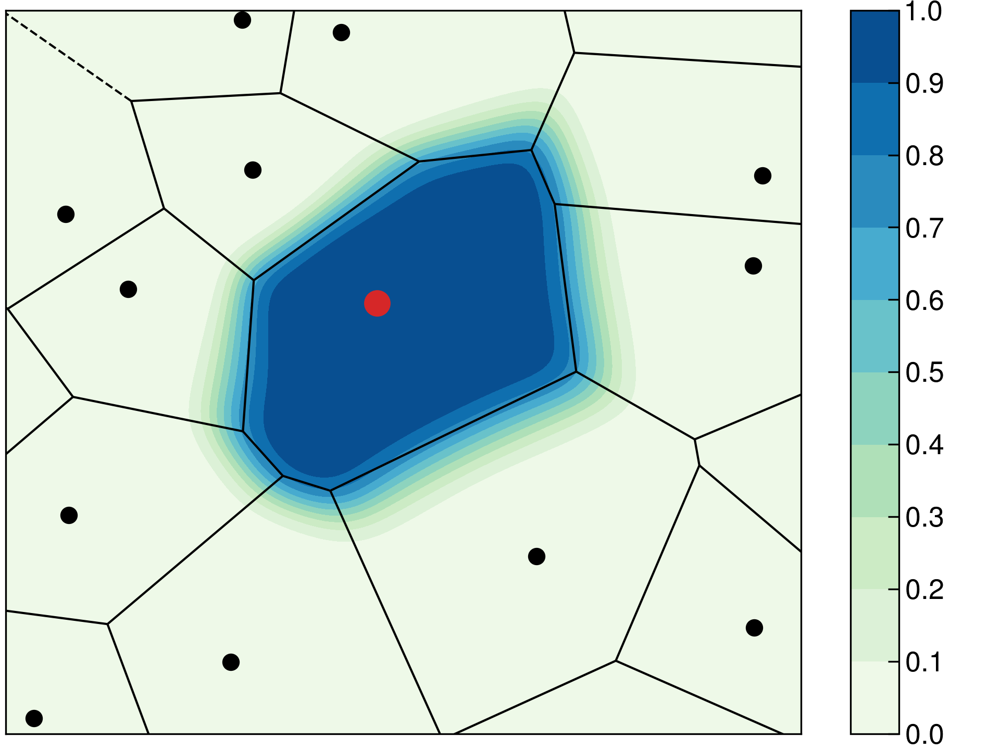
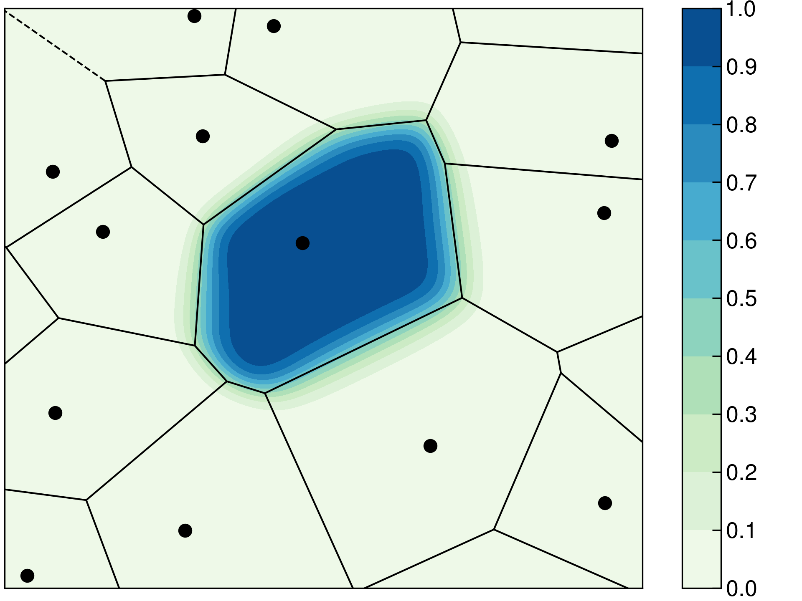

# Constrained DFT

This tutorial demonstrates how to perform constrained DFT (CDFT) simulations with CP2K. No previous
experience with CDFT simulations is required to complete this tutorial. However, a good
understanding of running DFT simulations with CP2K/QS is recommended before proceeding.

This tutorial is divided as follows. First, a brief overview of the underlying theory behind CDFT
will be presented. Typical applications where CDFT simulations have been used will also be
highlighted. The CDFT implementation in CP2K will then be described in detail in the next section
with the aid of realistic example calculations. The last part of this tutorial covers how to
calculate properties involving multiple CDFT states.

______________________________________________________________________

## CDFT in summary

CDFT is a tool for constructing charge and/or spin localized states. Such localized states are
needed in a number of applications. These include for example the following

- studying charge transfer phenomena and calculating electronic couplings (e.g. using the Marcus
  theory approach)
- correcting spurious charge delocalization due to self-interaction error
- parametrizing model Hamiltonians (e.g. the Heisenberg spin Hamiltonian)

A more exhaustive list of potential applications has been presented in this
[review article](https://dx.doi.org/10.1021/cr200148b).

The charge and spin localized states are created by enforcing electron and spin density localization
within atom centered regions of space. The relevant theory has been derived by Wu and Van Voorhis in
a series of key papers: [paper 1](https://dx.doi.org/10.1103/PhysRevA.72.024502),
[paper 2](https://dx.doi.org/10.1063/1.2360263), [paper 3](https://dx.doi.org/10.1063/1.2360263).
Further useful references can be found in the aforementioned review article. The CDFT implementation
of CP2K has been throughly described in these two papers:
[paper 1](https://dx.doi.org/10.1021/acs.jctc.6b01085) and
[paper 2](https://dx.doi.org/10.1063/1.5038959).

In this tutorial, only the main theoretical aspects needed to understand what is happening during a
CDFT simulation will be summarized. The charge/spin localized states can be generated by augmenting
the Kohn-Sham energy functional, $E_\mathrm{KS}$, by additional constraint potentials

$$
E_\mathrm{CDFT}[\rho, \vec{\lambda}] = \max_\vec{\lambda} \min_\rho \left( E_\mathrm{KS}[\rho] + \sum_c \lambda_c \left[\sum_{i = \uparrow, \downarrow} \int w_c^i(\mathbf{r})\rho^i(\mathbf{r})d\mathbf{r} - N_c \right] \right)
$$

where $\vec\lambda = [\lambda_1, \lambda_2, \cdots]^T$ are the constraint Lagrangian multipliers
("strength(s) of the constraint potential(s)"), $w^i(\mathbf{r})$ is an atom centered weight
function, and $N_c$ is the target value of the constraint. Multiple constraints can be included in a
CDFT simulation (the sum over $c$ above). The weight function is constructed as a normalized sum
over select constraint atoms $\mathcal{C}$

$$
w^i(\mathbf{r}) = \frac{\sum_{j \in \mathcal{C}}c_jP_j(\mathbf{r})}{\sum_{j \in \mathcal{N}}P_j(\mathbf{r})}
$$

where $c_j$ are atomic coefficients which determine how each atom is included in the constraint
(more on this later), $P_j$ is the so-called cell function which determines the volume occupied by
atom $j$ according to some population analysis method, and $\mathcal{N}$ is the set of all atoms in
a system. Different types of constraints can be constructed by modifying the weight function
according to the following conventions

- charge density constraint ($\rho^\uparrow + \rho^\downarrow$): $w^\uparrow = w^\downarrow = w$
- magnetization density constraint ($\rho^\uparrow - \rho^\downarrow$):
  $w^\uparrow = -w^\downarrow = w$
- spin specific constraint ($\rho^{\uparrow/\downarrow}$):
  $w^{\uparrow/\downarrow} = w, w^{\downarrow/\uparrow} = 0$

The Becke and Hirshfeld space partitioning schemes can be used as constraint weight functions in
CP2K. The main differences between these two constraints will be explained in a subsequent section.

When CDFT is used in a molecular dynamics or a geometry optimization simulation, additional force
terms arising from the constraints are calculated

$$
\mathbf{F}_{c,i} = -\lambda_c \int \frac{\partial w(\mathbf{r})}{\partial \mathbf{R}_i}\rho(\mathbf{r})d\mathbf{r}
$$

The CDFT energy expression, $E_\mathrm{CDFT}$, is solved self-consistently using a two-tiered
approach: one external optimization loop for the constraints, and an inner loop to converge the
electronic structure. In practice, three SCF loops are needed to integrate CDFT with the OT method,
which uses its own outer loop to reset the OT preconditioner. This process has been schematically
illustrated in Figure 1.

{align=center}

**Figure 1.** Schematic of the CDFT SCF procedure. The constraint Lagrangians $\vec\lambda$ are
first optimized in the outer CDFT loop, their values are subsequently fixed, and the electron
density corresponding to these fixed values is solved like in traditional CP2K DFT simulations. The
control is then returned to the outer CDFT loop where convergence of the constraints is checked.
This iteration process is repeated until convergence is achieved or until the number of maximum CDFT
SCF steps is reached. The structure of the CDFT loop will be further described below.

By definition, all constraints are satisfied when

$$
\vec c(\vec\lambda) = \left[ \sum_{i = \uparrow, \downarrow} \int w_1^i(\mathbf{r})\rho^i(\mathbf{r})d\mathbf{r} - N_1, \cdots \right]^T = \vec 0
$$

The constraint Lagrangian multipliers $\vec\lambda$ can therefore be optimized by minimizing the
constraint error expression $\max |\vec c(\vec\lambda)|$ until the largest element decreases below a
threshold $\varepsilon$. Root-finding algorithms are used to optimize $\lambda$. For Newton and
quasi-Newton class optimizers, a new guess for $\vec\lambda$ at step $n$ is generated according to
the following iteration formula

$$
\vec\lambda_n = \vec\lambda_{n-1} - \alpha \mathbf{J}_n^{-1}\vec c(\vec\lambda_{n-1})
$$

where $\alpha \in (0, 1]$ is the step size and $\mathbf{J}^{-1}$ is the inverse Jacobian matrix. The
step size $\alpha$ can be fixed or its value can be optimized with backtracking line search, where
the value of $\lambda$ is successively reduced if it decreases the constraint error function. The
Jacobian matrix is approximated with finite differences, e.g. using a first order forward difference
stencil, by perturbing each element of $\vec\lambda$ slightly and re-evaluating the value of
$\vec c$ self-consistently (an SCF energy optimization)

$$
\mathbf{J}_{ij} = \frac{\partial \vec c_i(\vec\lambda)}{\partial \lambda_j} \approx \frac{\vec c_i(\vec\lambda+\vec\delta_j)-\vec c_i(\vec\lambda)}{\left|\vec\delta_j\right|}
$$

where $\vec\delta_j$ is a small perturbation of the $j$th component of $\vec\lambda$.

______________________________________________________________________

## Using the CDFT module

The input section [](#CP2K_INPUT.FORCE_EVAL.DFT.QS.CDFT) is used to set up a CDFT simulation. A
brief description of this input section will be given in the next two subsections. Subsequently,
various aspects of running CDFT simulations will be explored through example calculations.

### Defining CDFT SCF parameters

Settings for the CDFT SCF loop are controlled by the input section
[](#CP2K_INPUT.FORCE_EVAL.DFT.QS.CDFT). An example of a typical CDFT input is given below. These
parameter selections should be suitable for most systems.

```
&QS
  ...
  ! CDFT loop settings
  ! Please note that prior to CP2K version 7.0,
  ! Becke constraints were separate from the CDFT section
  &CDFT
    TYPE_OF_CONSTRAINT BECKE
    ! Compute CDFT charges?
    ATOMIC_CHARGES  TRUE
    ! Constraint strength and target values
    ! Give one value per constraint
    STRENGTH        ${BECKE_STR}
    TARGET          ${BECKE_TARGET}
    ! Constraint definitions, each repetition defines a new constraint
    &ATOM_GROUP
      ATOMS 1
      COEFF 1
      CONSTRAINT_TYPE CHARGE
    &END ATOM_GROUP
    ! No constraint applied but calculate charges
    &DUMMY_ATOMS
      ATOMS 2
    &END DUMMY_ATOMS
    ! CDFT convergence and optimizer settings
    &OUTER_SCF ON
      TYPE CDFT_CONSTRAINT
      EXTRAPOLATION_ORDER 2
      MAX_SCF 10
      ! Convergence threshold
      EPS_SCF 1.0E-3
      ! Optimizer selection:
      ! Now Newton's method with backtracking line search
      OPTIMIZER NEWTON_LS
      ! Optimizer (initial) step size
      STEP_SIZE -1.0
      ! Note that the section CDFT_OPT exists in CP2K version >= 6.1
      ! Remove section for CP2K version 5.1 (keywords are unchanged)
      &CDFT_OPT ON
        ! Line search settings
        MAX_LS 5
        CONTINUE_LS
        FACTOR_LS 0.5
        ! Finite difference settings for Jacobian matrix
        JACOBIAN_STEP 1.0E-2
        JACOBIAN_FREQ 1 1
        JACOBIAN_TYPE FD1
        JACOBIAN_RESTART FALSE
      &END CDFT_OPT
    &END
    ! Settigs specific to Becke constraints
    &BECKE_CONSTRAINT
      ...
    &END BECKE_CONSTRAINT
    ! Print information about CDFT calculation
    &PROGRAM_RUN_INFO ON
      &EACH
        QS_SCF 1
      &END EACH
      COMMON_ITERATION_LEVELS 2
      ADD_LAST NUMERIC
      FILENAME ./${NAME}
    &END PROGRAM_RUN_INFO
  &END CDFT
&END QS
```

The structure of this input section is quite straightforward and consists of three parts:

- Constraint definitions (type, which atoms to include, constraint target, etc)
- CDFT SCF loop settings (solver, convergence criterion, etc)
- Constraint weight function specific settings (Becke/Hirshfeld subsections)

In the above example, a Becke constraint is selected using the keyword
[TYPE_OF_CONSTRAINT](#CP2K_INPUT.FORCE_EVAL.DFT.QS.CDFT.TYPE_OF_CONSTRAINT). The actual constraints
are defined using the section [ATOM_GROUP](#CP2K_INPUT.FORCE_EVAL.DFT.QS.CDFT.ATOM_GROUP). Each
repetition of this section defines a new constraint. The constraint atoms are selected with the
keyword [ATOMS](#CP2K_INPUT.FORCE_EVAL.DFT.QS.CDFT.ATOM_GROUP.ATOMS) and the keyword
[COEFF](#CP2K_INPUT.FORCE_EVAL.DFT.QS.CDFT.ATOM_GROUP.COEFF) determines how the atoms are summed up
to form the constraint. Usually all coefficients are set to +1, but mixing +1 and -1 coefficients
would define the constraint as the difference between two groups of atoms. The keywords
[TARGET](#CP2K_INPUT.FORCE_EVAL.DFT.QS.CDFT.TARGET) and
[STRENGTH](#CP2K_INPUT.FORCE_EVAL.DFT.QS.CDFT.STRENGTH) define the constraint target values and the
initial constraint strengths $\vec\lambda$, respectively. The constraint target value should be the
desired number of valence electrons on the constraint atoms, suitably multiplied by atomic
coefficients in case a relative constraint between two atom groups has been used. The constaint type
is selected with the keyword
[CONSTRAINT_TYPE](#CP2K_INPUT.FORCE_EVAL.DFT.QS.CDFT.ATOM_GROUP.CONSTRAINT_TYPE). It is also
possible to use fragment based constraints
[FRAGMENT_CONSTRAINT](#CP2K_INPUT.FORCE_EVAL.DFT.QS.CDFT.ATOM_GROUP.FRAGMENT_CONSTRAINT), in which
case the constraint target value is calculated from the superposition of isolated fragment densities
according to the scheme in Figure 2.

{align=center width=350px}

**Figure 2.** Using a fragment based CDFT constraint. The system is first divided into two fragments
with atomic positions fixed in the same configuration as in the full system. The electron and spin
densities of the fragment systems are then saved to cube files and subsequently used as input files
for the CDFT calculation, where the constraint target value is calculated from the superimposed
fragment densities.

The OUTER_SCF section within the CDFT section defines settings for the CDFT SCF loop. The keyword
[EPS_SCF](#CP2K_INPUT.FORCE_EVAL.DFT.QS.CDFT.OUTER_SCF.EPS_SCF) defines the CDFT constraint
convergence threshold $\varepsilon$ and
[OPTIMIZER](#CP2K_INPUT.FORCE_EVAL.DFT.QS.CDFT.OUTER_SCF.OPTIMIZER) selects the CDFT optimizer.
Using Newton or quasi-Newton optimizers (Broyden methods) is recommended for most applications.
These optimizers accept additional control settings that define how the Jacobian matrix is
calculated (keywords `JACOBIAN_*`) and how to optimize the step size $\alpha$ (keywords `*_LS`).
These keywords are available in the
[CDFT_OPT](#CP2K_INPUT.FORCE_EVAL.DFT.QS.CDFT.OUTER_SCF.CDFT_OPT) section. MD simulations with a
single constraint might benefit from using the bisect optimizer, which avoids building the Jacobian
matrix, in case a considerable amount of the total time per MD step is spent in building the
Jacobian. Notice, however, that the frequency of Jacobian rebuilds
[JACOBIAN_FREQ](#CP2K_INPUT.FORCE_EVAL.DFT.QS.CDFT.OUTER_SCF.CDFT_OPT.JACOBIAN_FREQ) can be
controlled on a per MD step and per CDFT SCF step basis. The Broyden optimizers require less
frequent rebuilds of the Jacobian matrix because the matrix is
[rank-one updated](https://en.wikipedia.org/wiki/Broyden%27s_method) every iteration, although the
stability of the method with respect to the rebuild frequency needs to be carefully studied.

Above, for instance, the Jacobian is explicitly calculated every CDFT SCF iteration and MD step by
perturbing each constraint Lagragian using a first order forward difference stencil with a step size
of $10^{-2}$. The Newton step size is optimized with backtracking line search using the update
formula $\alpha_n = 0.5*\alpha_{n-1}$ for a maximum of 5 steps as long as the CDFT constraint error
decreases.

### Available constraints

The CDFT module in CP2K currently supports using Becke or Hirshfeld based constraints. The main
aspects of these weight functions and their use as CDFT constraints will be explained in this
section. Weight function specific settings are defined in the sections
[BECKE_CONSTRAINT](#CP2K_INPUT.FORCE_EVAL.DFT.QS.CDFT.BECKE_CONSTRAINT)
[HIRSHFELD_CONSTRAINT](#CP2K_INPUT.FORCE_EVAL.DFT.QS.CDFT.HIRSHFELD_CONSTRAINT). If you want to
visualize the weight functions to e.g. see the effects of using different parameters, you can use
the section [WEIGHT_FUNCTION](#CP2K_INPUT.FORCE_EVAL.DFT.QS.CDFT.PROGRAM_RUN_INFO.WEIGHT_FUNCTION)
to print the CDFT weight function to a cube file.

#### Becke constraints

The Becke density partitioning method can be considered as a smoothed Voronoi scheme. In Voronoi
partitioning, the volume occupied by each atom is the set of real space grid points $\mathbf{r}$
which are closer to that particular atom than to any other atom in the system. An example Voronoi
diagram is given below in Figure 3. The line segments in this figure define real space points which
are equidistant from two atoms, while vertices correspond to grid points which are equidistant from
three or more atoms. The Becke cell function $P_i$ is overlayed on top of the Voronoi diagram and it
decays smoothly from 1 to 0 across the Voronoi polyhedron boundary. Using a smooth density
partitioning function improves numerical stability in simulations.

{align=center width=400px}

{align=center width=400px}

**Figure 3.** Comparison of the Voronoi (lines) and Becke partitioning (contours) schemes. At left,
the Becke partitioning is performed without atomic size information. At right, the size of the red
atom is 30 % larger than the black atoms, and the contours of the red atom extend farther than
without atomic size adjustments.

The Voronoi and, by extension, the Becke partitioning methods treat each element equally. This leads
to unphysical partial charges in most systems. For example, the Becke scheme predicts a positive
charge on oxygen and a negative charge on hydrogen in water (see examples for input files). This
problem can be remedied by accounting for atomic radii during the partitioning. This behavior is
activated by the keyword
[ADJUST_SIZE](#CP2K_INPUT.FORCE_EVAL.DFT.QS.CDFT.BECKE_CONSTRAINT.ADJUST_SIZE) and the atomic radii
are defined with the keyword
[ATOMIC_RADII](#CP2K_INPUT.FORCE_EVAL.DFT.QS.CDFT.BECKE_CONSTRAINT.ATOMIC_RADII). The atomic radii
should be set to values that reflect the system under simulation, e.g. using additive covalent radii
for covalent molecules or Shannon's ionic radii for ionic compounds. An example on how atomic size
adjustments affect the Becke cell functions has been visualized above in Figure 3 at right, where
the size of the red atom is set to a value 30 % larger than the black atoms causing the red atom's
contours to extend farther than without atomic size adjustments.

The algorithmic implementation of the Becke density partitioning method has been detailed
[here](https://dx.doi.org/10.1021/acs.jctc.6b01085). In brief, this involves iterating over each
atom pair permutation $\{\mathbf{R}_i, \mathbf{R}_j\}, j\neq i$ at every real space grid point
$\mathbf{r}$. This leads to a poor scaling with respect to the system size (cell size and planewave
cutoff) and the number of atoms within the system, and is particularly troublesome for solvated
system simulations. The computational cost of the Becke method can be considerably decreased by
noting that only the grid points within a cutoff distance $R_{cutoff}$
([CUTOFF_TYPE](#CP2K_INPUT.FORCE_EVAL.DFT.QS.CDFT.BECKE_CONSTRAINT.CUTOFF_TYPE)) of atoms involved
in constraints actually need to be considered. The other grid points can be efficiently screened
with constraint atom centered spherical Gaussian functions, activated by the keyword
[CAVITY_CONFINE](#CP2K_INPUT.FORCE_EVAL.DFT.QS.CDFT.BECKE_CONSTRAINT.CAVITY_CONFINE) and controlled
by other keywords of the form `CAVITY_*`. The exact details of this confinement scheme and why it
can be used are explained in the implementation paper.

An example of a Becke constraint input section is given below. This choice of parameters should be
reasonable for most systems, ignoring the atomic radii and constraint definitions which are system
dependent. Decreasing the partitioning cutoff might be useful for solvated system MD simulations,
but extensive testing is always necessary before starting production simulations.

```none
&CDFT
  ...
  &BECKE_CONSTRAINT
    ! Take atomic radii into account?
    ADJUST_SIZE     FALSE
    ATOMIC_RADII    0.63 0.32
    ! Cutoff scheme
    CUTOFF_TYPE     ELEMENT
    ELEMENT_CUTOFF  6.0
    ! Perform Becke partitioning only within the space
    ! spanned by constraint atom centered spherical Gaussians
    ! (reduces cost for solvated systems)
    CAVITY_CONFINE  TRUE
    CAVITY_SHAPE    VDW
    EPS_CAVITY      1.0E-7
    IN_MEMORY       TRUE
    SHOULD_SKIP     TRUE
&END CDFT
```

#### Hirshfeld constraints

Hirshfeld constraints are cheaper to construct than Becke constraints in large systems because
Hirshfeld constraints are essentially just weighted sums of spherical Gaussian functions. The
keywords [SHAPE_FUNCTION](#CP2K_INPUT.FORCE_EVAL.DFT.QS.CDFT.HIRSHFELD_CONSTRAINT.SHAPE_FUNCTION)
and [GAUSSIAN_SHAPE](#CP2K_INPUT.FORCE_EVAL.DFT.QS.CDFT.HIRSHFELD_CONSTRAINT.GAUSSIAN_SHAPE) define
which type of Hirshfeld constraint to apply to the system, consistent with the options for printing
of Hirshfeld atomic charges (see
[SHAPE_FUNCTION](#CP2K_INPUT.FORCE_EVAL.DFT.PRINT.HIRSHFELD.SHAPE_FUNCTION)).

The shape function keyword accepts two values: Gaussian or Density.

- The first choice implies that the CDFT weight function for each atom is a single Gaussian function
  whose radius is controlled by the GAUSSIAN_SHAPE keyword. By default, tabulated covalent radii are
  used as the radii of the Gaussian, but it is also possible to select van der Waals radii or to
  define custom radii.
- The latter choice implies that the atomic weight function are constructed from isolated atomic
  densities which are expanded in terms of multiple spherical Gaussians. This choice avoids the
  introduction of any empirical parameters, and generally provides a more robust description of
  atomic charges than either Becke or Gaussian based Hirshfeld charge partitioning.

### Selected examples

(example-zn-dimer-cation)=

#### Zn dimer cation

In this example, we will perform two CDFT simulations for the Zn dimer cation $\mathrm{Zn}_2^+$. As
the distance $R$ between the two atoms is increased, the excess charge in the system should localize
onto one of the Zn atoms forming $\mathrm{Zn}^+ + \mathrm{Zn}$. With standard GGA and hybrid
functionals, such as PBE, PBE0, BLYP or B3LYP, this is however not the case. The excess charge will
instead be equally shared among the two atoms $\mathrm{Zn}^{0.5+} + \mathrm{Zn}^{0.5+}$ regardless
of separation. We can force the charge to localize onto one of these atoms with CDFT.

You can download the input files from
[here](https://www.cp2k.org/_media/:howto:cdft-tutorial-zn.zip). Unzip the folder and execute the
file `energy.bash` (use flag `-h` for usage instructions) to run a standard DFT calculation,
followed by two CDFT simulations where the first Zn atom is constrained to charges +1 and 0,
respectively. The script will also run a mixed CDFT calculation, which will be analyzed in a
[subsequent section](#example-coupling-zn-cation-dimer). Modify paths to basis sets and other CP2K
data files in the file `dft-common-params.inc` in case they are in non-standard paths relative to
the CP2K binary. The calculations will take a while to run. In the meanwhile, you can

- Check the calculated partial charges in the standard DFT output file
- Study the script file to understand how it works
- Study the generated output files from the CDFT simulations

Assuming the CDFT simulations have finished, the following files were generated

- `*.out`
  - This is the standard CP2K output file and now also contains all the output from the CDFT SCF
    iterations. Each iteration step starts a new DFT energy optimization using new values of the
    constraint Lagrangian multipliers $\vec{\lambda}$, as generated by the selected CDFT optimizer.
  - An example output from the end of one the CDFT simulations is provided below.
  - Information about the CDFT SCF iteration process and the constraints and their convergence is
    printed alongside the usual CP2K SCF iteration information.
  - With CDFT optimizers that support backtracking line search, the density optimization process at
    each CDFT SCF step is restarted from the optimized constraint strength and density obtained
    previously during line search. Consequently, when the line search was successful (i.e. the
    energy optimization converged), the density optimization should converge terminate in exactly 1
    step each CDFT SCF iteration (refer to the output files, as this should now be the case).
- `*-LineSearch.out`
  - The progress of the optimization of the Newton step size $\alpha$ using backtracking line search
    is reported in this file. Observe that the step size is halved on each iteration if the CDFT
    constraint error ("Deviation from target" in the output) decreases.
- `*.cdftLog`
  - CDFT parameters (atomic radii, constraint definitions and cutoffs) and Becke partial charges are
    printed in these files.
- `*-JacobianInfo.out`
  - The output from the calculation of the Jacobian matrix $\mathbf{J}$ is reported in this file.
- `*.inverseJacobian`
  - This is a restart file for the inverse Jacobian matrix.

Using the above list, study the generated output files to understand how the CDFT SCF loop is
integrated with the standard CP2K DFT SCF process.

```none
  SCF WAVEFUNCTION OPTIMIZATION

  ----------------------------------- OT ---------------------------------------
  Minimizer      : DIIS                : direct inversion
                                         in the iterative subspace
                                         using   7 DIIS vectors
                                         safer DIIS on
  Preconditioner : FULL_ALL            : diagonalization, state selective
  Precond_solver : DEFAULT
  stepsize       :    0.15000000                  energy_gap     :    0.08000000
  ortho_irac     : CHOL                           irac_degree        :             4
  max_irac       :            50                  eps_irac           :   0.10000E-09
  eps_irac_switch:   0.10000E-01                  eps_irac_quick_exit:   0.10000E-04
  on_the_fly_loc     : F
  ----------------------------------- OT ---------------------------------------

  Step     Update method      Time    Convergence         Total energy    Change
  ------------------------------------------------------------------------------
qs_ot_get_orbitals_ref  0: ||P-I||= 0.10493E-10, ortho_irac = POLY
qs_ot_ref_poly  1: quick exit!
qs_ot_get_orbitals_ref  0: ||P-I||= 0.11959E-12, ortho_irac = POLY
qs_ot_ref_poly  1: quick exit!
     1 OT DIIS     0.15E+00    2.5     0.00000022      -120.6126709217 -1.21E+02

  *** SCF run converged in     1 steps ***


  Electronic density on regular grids:        -22.9999999253        0.0000000747
  Core density on regular grids:               24.0000000000       -0.0000000000
  Total charge density on r-space grids:        1.0000000746
  Total charge density g-space grids:           1.0000000746

  Overlap energy of the core charge distribution:               0.00000000000000
  Self energy of the core charge distribution:               -159.30058829583706
  Core Hamiltonian energy:                                     50.63132167014943
  Hartree energy:                                               5.66516329750697
  Exchange-correlation energy:                                -17.60803221234604
  Dispersion energy:                                           -0.00058223840320

  Total energy:                                              -120.61267092172808

  outer SCF iter =    1 RMS gradient =   0.22E-06 energy =       -120.6126709217
  outer SCF loop converged in   1 iterations or    1 steps


  CDFT SCF iter =     5 RMS gradient =   0.13E-03 energy =       -120.6126709217
  CDFT SCF loop converged in   5 iterations or   37 steps


  --------------------- Becke constraint information ---------------------
  Atomic group                :                                          1
  Type of constraint          :                  Charge density constraint
  Target value of constraint  :                            11.000000000000
  Current value of constraint :                            11.000126158558
  Deviation from target       :                                  1.262E-04
  Strength of constraint      :                             0.371415167271
  ------------------------------------------------------------------------
```

#### Charge transfer energy in water dimer

In this example, we will calculate the charge transfer energy, $-\Delta E_\mathrm{CT}$, of water
dimer. This quantity is conveniently defined in CDFT as (see
[here](https://dx.doi.org/10.1039/C6CP07475H))

$$
-\Delta E_\mathrm{CT} = E_\mathrm{CDFT}-E_\mathrm{DFT}
$$

where $E_\mathrm{DFT}$ is the DFT total energy of the system, and $E_\mathrm{CDFT}$ is the CDFT
energy of the system when charge transfer between the two molecules is prevented.

We will calculate the charge transfer energy with four different constraints: default Becke
constraint, Becke constraint with atomic size adjustments using covalent radii from
[this publication](https://dx.doi.org/10.1002/chem.200800987), and a fragment based Becke constraint
with and without the same atomic size adjustments. The input files can be downloaded from
[here](https://www.cp2k.org/_media/:howto:cdft-tutorial-water.zip). Execute the file `energy.bash`
to run all the simulations: standard DFT simulations for the full and two fragment systems, and the
aforementioned CDFT simulations with different constraints. Modify the include (`.inc`) file if
necessary as you would have before. Study the input files while the calculations are running.

After the calculations have finished, answer the following questions

- Compare the partial charges of unconstrained PBE water as predicted by the Becke population
  analysis method with and without atomic size adjustments (Hint: the CDFT calculations were
  restarted from the DFT wavefunction)
- How much charge is transferred between the two water molecules according to the different
  constraint methods? Note that net charges for fragment based constraints are not reported with
  respect to the core charge, but they can be recovered by post-processing the reported absolute
  populations. Instead, each atomic charge is referenced to the number of electrons per atom in the
  system where the isolated densities are superimposed.
- Compare the calculated charge transfer energies to the
  [reference value 1.7 mHa](https://dx.doi.org/10.1039/C6CP07475H), calculated at the
  PBE0/def-QZVP/CDFT level of theory using a different code and constraint. Which is closest to the
  reference value? Why? (Hint: Look at previous question)

#### Zn dimer cation with Hirshfeld constraints

<note important>This simulation requires CP2K version 7.0 or later.</note>

This tutorial is exactly the same as the Zn dimer example above but using Hirshfeld partitioning
based constraints instead of Becke constraints. You can find the input files
[here](https://www.cp2k.org/_media/:howto:cdft-tutorial-hirshfeld.zip).

It might be instructive to visualize how the Becke and Hirshfeld weight function schemes differ, in
particular, how the methods assign a volume to each atom in the system. You can activate the section
[WEIGHT_FUNCTION](#CP2K_INPUT.FORCE_EVAL.DFT.QS.CDFT.PROGRAM_RUN_INFO.WEIGHT_FUNCTION) to output the
weight function as a cube file which you can visualize with e.g. VMD. Feel free to modify the water
tutorial above to look at the differences between Becke and Hirshfeld constraints in a system with
different chemical elements.

______________________________________________________________________

## Using the mixed CDFT module

Additional properties can be calculated from the interactions between CDFT states. In CP2K, these
types of simulations are called mixed CDFT simulations because the module leverages the
[MIXED FORCE_EVAL](#CP2K_INPUT.FORCE_EVAL.MIXED) type to efficiently treat multiple CDFT states in
parallel. Mixed CDFT calculations are useful in a number of applications including

- Calculating charge transfer kinetics parameters
- Performing configuration interaction calculations within the basis of CDFT states

In this part of the tutorial, the theoretical basis for mixed CDFT will first be established. The
quantities accessible through such simulations will also be introduced. The structure of a mixed
CDFT input file will then be discussed. The tutorial is concluded with a walk through of an example
calculation.

### Theoretical basis

The theoretical concepts related to mixed CDFT calculations are best introduced through an example.
Consider the following one electron transfer processs <chem>X^- + Y -> X + Y^-</chem>. Denote the
initial and final states of this reaction as A and B, respectively. Now, according to the Marcus
theory of electron transfer, the charge transfer rate of this reaction is given by the rate equation

$$
k_\mathrm{ab}=\frac{2\pi}{\hbar}\frac{\left<\left|\mathbf{H}_\mathrm{ab}\right|^2\right>_T}{\sqrt{4\pi k_bT\xi}}\exp\left(-\frac{(\xi+\Delta A)^2}{4\pi k_bT\xi} \right)
$$

where $\Delta A$ is the reaction free energy, $\xi$ is the solvent reorganization energy, and
$\left|\mathbf{H}_\mathrm{ab}\right|$ is the electronic coupling. The first two quantities can be
obtained from free energy simulations as discussed e.g. in
[here](https://dx.doi.org/10.1021/acs.jctc.6b01085). The electronic coupling is rigorously defined
as the interaction energy between wavefunctions $\Psi$ representing the two reaction states

$$
\mathbf{H}_\mathrm{ab} = \left<\Psi_\mathrm{a}\left| \mathcal{H}\right|\Psi_\mathrm{b}\right>
$$

where $\mathcal{H}$ is the many-electron Hamiltonian operator. The usefulness of the electronic
coupling quantity is not limited to the Marcus rate equation, but it also a central quantity in
other charge transfer theories as well as in CDFT based
[configuration interaction](https://dx.doi.org/10.1063/1.2800022).

The true, interacting many-electron wavefunctions or the Hamiltonian are not available in CDFT
simulations. The electronic coupling is instead approximated using the CDFT surrogates

$$
\mathbf{H}_\mathrm{AB} \approx \left<\Phi_\mathrm{A}\left| \mathcal{H}_\mathrm{KS}\right|\Phi_\mathrm{B}\right> = E_\mathrm{B}S_\mathrm{AB}-\sum_c \lambda_c^\mathrm{B} \mathbf{W}_c^\mathrm{AB} \\
\mathbf{H}_\mathrm{BA} \approx \left<\Phi_\mathrm{B}\left| \mathcal{H}_\mathrm{KS}\right|\Phi_\mathrm{A}\right> = E_\mathrm{A}S_\mathrm{BA}-\sum_c \lambda_c^\mathrm{A} \mathbf{W}_c^\mathrm{BA}
$$

where $\Phi$ are the CDFT Kohn-Sham determinants,
$S_\mathrm{AB}= \left<\Phi_\mathrm{A}|\Phi_\mathrm{B}\right>$, $E_\mathrm{I}$ is the CDFT energy of
state $\mathrm{I}$, and $\mathbf{W}_c^\mathrm{AB}$ are the weight function matrices defined by

$$
\mathbf{W}_c^\mathrm{AB} = \left<\Phi_\mathrm{A}\left| w_c^\mathrm{B}(\mathbf{r}) \right|\Phi_\mathrm{B}\right> 
$$

In the above expressions, capital subscripts have been used to emphasize the fact that the CDFT
determinants are in general nonorthogonal. The electronic couplings and overlaps are collected into
matrices $\mathbf{H}$ and $\mathbf{S}$, respectively. The off-diagonal elements of $\mathbf{H}$ are
not symmetric. The matrix is converted to symmetric form by setting

$$
\mathbf{H'}_\mathrm{AB}=\frac{\mathbf{H}_\mathrm{AB}+\mathbf{H}_\mathrm{BA}}{2} = \frac{E_\mathrm{A}+E_\mathrm{B}}{2}S_\mathrm{AB}-\sum_c \left<\Phi_\mathrm{A}\left|\frac{\lambda_c^\mathrm{A}w_c^\mathrm{A}(\mathbf{r})+\lambda_c^\mathrm{B}w_c^\mathrm{B}(\mathbf{r})}{2} \right|\Phi_\mathrm{B}\right>  
$$

and setting $\mathbf{H'}_\mathrm{BA}=\mathbf{H'}_\mathrm{AB}$.

The resulting matrix $\mathbf{H'}$ is then orthogonalized to yield the final electronic coupling.
The following orthogonalization methods are available:

- Rotate CDFT states to eigenstates of the weight matrix $\mathbf{W}$. This is the default behavior
  for systems with only one constraint that is identically defined across all CDFT states, not
  applicable otherwise.
- Löwdin's symmetrical orthogonalization
  $\mathbf{H} = \mathbf{S}^{-1/2}\mathbf{H}'\mathbf{S}^{-1/2}$. This is the default behavior for
  systems with multiple constraints and can always be activated with the keyword
  [LOWDIN](#CP2K_INPUT.FORCE_EVAL.MIXED.MIXED_CDFT.LOWDIN).
- The so-called wavefunction overlap method where the ground state Kohn-Sham solution is represented
  as the linear combination of CDFT states, see keyword
  [WFN_OVERLAP](#CP2K_INPUT.FORCE_EVAL.MIXED.MIXED_CDFT.WFN_OVERLAP).

### Structure of input file

Mixed CDFT calculations are activated through the [MIXED FORCE_EVAL](#CP2K_INPUT.FORCE_EVAL.MIXED)
section by setting [MIXING_TYPE](#CP2K_INPUT.FORCE_EVAL.MIXED.MIXING_TYPE) to MIXED_CDFT and
providing an appropriate [MIXED_CDFT](#CP2K_INPUT.FORCE_EVAL.MIXED.MIXED_CDFT) input section. The
individual CDFT states involved in a mixed CDFT calculation should correspond to different
localizations of charge and/or spin in the same system. The constraint definitions do not have to be
identical (i.e. defined using the same sets of atoms) in all states as long as the number of
constraints is the same.

The CDFT states are included as their own [FORCE_EVAL](#CP2K_INPUT.FORCE_EVAL) sections. It is
highly recommended that the CDFT states are first converged in separate simulations, the
[FORCE_EVAL](#CP2K_INPUT.FORCE_EVAL) sections from these simulations are then copy-pasted into the
mixed CDFT input file, and the mixed CDFT method is used as post-processing analysis tool. The
converged wavefunctions and constraint strengths $\vec\lambda$ should be supplied as restart
quantities for the mixed CDFT calculation. Using templates and the CP2K `@include` and `@set`
directives is strongly encouraged to keep the mixed CDFT input tidy, see the example input file
below

```none
&FORCE_EVAL
  METHOD MIXED
  &MIXED
    MIXING_TYPE MIXED_CDFT
    NGROUPS  1
    &MIXED_CDFT
      ! Calculate mixed CDFT properties every COUPLING step
      COUPLING     1
      ! Settings determining how forces are mixed
      FORCE_STATES 1 2
      LAMBDA       1.0
      ! Orthogonalize CDFT states using Lowdin's method
      ! in addition to standard method
      LOWDIN      TRUE
      ! Configuration interaction?
      CI          FALSE
      ! Turn on printing
      &PRINT
        &PROGRAM_RUN_INFO ON
        &END
      &END PRINT
    &END MIXED_CDFT
  &END MIXED
  @include subsys.inc
&END FORCE_EVAL
# Zn+ Zn
&FORCE_EVAL
  @SET WFN_FILE       ${WFN_FILE_1}
  @SET RESTART        ${RESTART_1}
  @SET NAME           ${PROJECT_NAME}-state1
  @SET BECKE_TARGET   ${BECKE_TARGET_1}
  @SET BECKE_STR      ${BECKE_STR_1}
  METHOD QS
  @include ${DFT_FILE}
&END FORCE_EVAL
# Zn Zn+
&FORCE_EVAL
  @SET WFN_FILE       ${WFN_FILE_2}
  @SET RESTART        ${RESTART_2}
  @SET NAME           ${PROJECT_NAME}-state2
  @SET BECKE_TARGET   ${BECKE_TARGET_2}
  @SET BECKE_STR      ${BECKE_STR_2}
  METHOD QS
  @include ${DFT_FILE}
&END FORCE_EVAL
```

In the above example input file, a common file `${DFT_FILE}` is used as a template for the
[DFT](#CP2K_INPUT.FORCE_EVAL.DFT) subsection. The CDFT state specific constraint settings and the
wavefunction filename are passed through variables. The electronic coupling is calculated using the
default weight function matrix and Löwdin orthogonalization methods. If molecular dynamics were
performed with the above input file, the forces would be mixed according to linear mixing scheme
$F
= \\lambda F_1 + (1-\\lambda)
F_2$, where the states $F_i$ are selected with the keyword
[FORCE_STATES](#CP2K_INPUT.FORCE_EVAL.MIXED.MIXED_CDFT.FORCE_STATES) and the mixing parameter
\$\\lambda\$ with [LAMBDA](#CP2K_INPUT.FORCE_EVAL.MIXED.MIXED_CDFT.LAMBDA). No configuration
interaction calculation is performed. The [MIXED_CDFT](#CP2K_INPUT.FORCE_EVAL.MIXED.MIXED_CDFT)
section accepts some additional keywords, which have been described in the manual.

The keyword [NGROUPS](#CP2K_INPUT.FORCE_EVAL.MIXED.NGROUPS) is set to 1, which implies that the two
CDFT states are treated sequentially utilizing the full set of $N$ MPI processes for the simulation.
The CDFT weight function and its gradients are copied from state to state if the constraints
definitions are identical in each CDFT state, because construction of these terms might be expensive
in large systems.

The keyword [NGROUPS](#CP2K_INPUT.FORCE_EVAL.MIXED.NGROUPS) could also be set to 2 or a larger value
if using more than 2 CDFT states. In this case, each CDFT state is solved in parallel using
$N/N_\mathrm{groups}$ processors. This will likely reduce the wall clock time of your simulation at
the expense of more computing resources. However, you should note that the weight function and its
gradients are computed separately for each state instead of copied from state to state (if
possible). This can be costly for large solvated systems.

A special run type is available for `NGROUPS 2` if the keyword
[PARALLEL_BUILD](#CP2K_INPUT.FORCE_EVAL.MIXED.MIXED_CDFT.PARALLEL_BUILD) is activated. In this case,
the CDFT weight function and gradients are first built in parallel on $N$ MPI processes, which are
subsequently copied onto the two MPI processor groups of size $N/2$ which solve the CDFT states in
parallel. This operating mode is limited to two CDFT states with one identically defined total
charge density constraint. This operating mode is an advanced feature which might be useful for
large scale MD simulations to save computational wallclock time at the expense of higher CPU core
usage. The operating mode should only be used in conjuction with
[dynamic load balancing](#CP2K_INPUT.FORCE_EVAL.MIXED.MIXED_CDFT.DLB) if possible, and will likely
require tweaking the load balancing parameters.

(example-coupling-zn-cation-dimer)=

### Example: Electronic coupling of Zn cation dimer

In this example, we will calculate the electronic coupling for the reaction
$\mathrm{Zn}^+ +\mathrm{Zn} \rightleftharpoons \mathrm{Zn}+ \mathrm{Zn}^+$. The initial and final
states of this reaction were already converged with CDFT in a
[previous section of this tutorial](#example-zn-dimer-cation). That part of the tutorial must be
completed before proceeding. The full input files, in particular the mixed CDFT input file
`energy_mixed.inp`, were also given in that section.

The converged CDFT states are used as input for the mixed CDFT calculation. The calculation does not
take long to run as a result. The mixed CDFT input file uses template files to keep the input tidy,
as was discussed in the previous section. Find and study the corresponding section in the
`energy.bash` script file to see how variables in the main mixed CDFT template `energy_mixed.inp`
are initialized.

A number of files are generated by the mixed CDFT calculation. The main output from the calculation
can be found in the file `Zn-5A-mixed-cdft.out`. The relevant part of the output is included below.
The mixed CDFT analysis is printed after the header lines `MIXED_CDFT|`. For each unique CDFT state
permutation $\{i,j\}, i<j$, the constraint information is first summarized, the overlap and charge
transfer energies are printed, and the calculated electronic coupling(s) (and possibly other
quantities) are outputted. Here, both tested orthogonalization methods yield an electronic coupling
of 5.67 mHa, in agreement with the [5.49 mHa estimate](https://dx.doi.org/10.1063/1.4867077) from
the more expensive wavefunction based method CASSCF/MRCI+Q.

```none
 MIXED_CDFT| Activating mixed CDFT calculation
 MIXED_CDFT| Number of CDFT states:                                            2
 MIXED_CDFT| CDFT states calculation mode: serial
 MIXED_CDFT| Becke constraint is built before the SCF procedure of the first
             CDFT state and subsequently copied to other states
 MIXED_CDFT| Calculating electronic coupling between states:                   T
 MIXED_CDFT| Calculating electronic coupling reliability metric:               F
 MIXED_CDFT| Configuration interaction (CDFT-CI) was requested:                F
 MIXED_CDFT| Block diagonalizing the mixed CDFT Hamiltonian:                   F
 MIXED_CDFT| Dynamic load balancing enabled:                                   F
 MIXED_CDFT| Matrix inversions calculated with LU decomposition.

  ------------------------- CDFT coupling information --------------------------
  Information at step (fs):                                                 0.00

  ############################################
  ###### CDFT states I =  1 and J =   2 ######
  ############################################
  Atomic group:                                                                1
  Strength of constraint I:                                       0.371415167271
  Strength of constraint J:                                      -0.378315361740
  Final value of constraint I:                                   11.000125488935
  Final value of constraint J:                                   11.999828674539

  Overlap between states I and J:                                 0.030261294466
  Charge transfer energy (J-I) (Hartree):                         0.000739539045

  Diabatic electronic coupling (rotation, mHartree):              5.674875246867
  Diabatic electronic coupling (Lowdin, mHartree):                5.674714192287
  ------------------------------------------------------------------------------
 NO FORCE_EVAL section calculated the dipole

 ENERGY| Total FORCE_EVAL ( MIXED ) energy (a.u.):          -120.612670921735003
```

Other files created during the execution are related to the individual CDFT states. The `*-r-1.out`,
`*-r-2.out`, ... files are the main output files for the CDFT simulations of the studied states.
Because preconverged solutions were employed, these CDFT simulations terminate immediately after the
first SCF step, and any matrices that are subsequently needed in the mixed CDFT analysis are stored
in memory. In the input file, the full project name and CDFT state ID number were stored in the
variable `\$\{NAME}` on a per state basis. This variable was used to prepend the name of any other
output files (e.g. the cdftLog files) that are created during the CDFT simulation of the individual
CDFT states. The output files from different CDFT states are therefore straightforward to
distinguish. The content of the additional files was discussed in a
[previous section](#example-zn-dimer-cation).

### Example: Configuration interaction calculations with CDFT (CDFT-CI): The case of $\mathrm{H}_2^+$

DFT exchange-correlation functionals suffer from varying degrees of self-interaction error (SIE). A
pathological example of a system where SIE leads to unphysical results with DFT is the simple
dissociation reaction

$\mathrm{H}_2^+ \rightarrow \mathrm{H}^+ + \mathrm{H}$.

Even though this system contains only 1 electron, the dissociation profile obtained with PBE notably
deviates from the exact Hartree-Fock profile as shown in Figure 4 below.

{align=center width=450px}

**Figure 4.** Illustration of DFT self-interaction error for the reaction
$\mathrm{H}_2^+ \rightarrow \mathrm{H}^+ + \mathrm{H}$. PBE notably deviates from the exact
Hartree-Fock dissociation profile. The correct profile can be recovered with constrained DFT
configuration interaction (CDFT-CI) using fragment constraint states $|\mathrm{H^+H}>$ and
$|\mathrm{HH^+}>$ as the basis.

We can use CDFT states as the basis of a configuration interaction (CI) simulation to correct for
SIE in this system. As the figure above shows, CDFT-CI using the PBE functional is able to reproduce
the exact dissociation profile. You can read up on the theory behind CDFT-CI simulations from the
references given at the start of this tutorial. Very briefly, CDFT-CI simulations involve
representing the system's wavefunction as a linear combination of multiple CDFT states where the
charge/spin density is constrained differently in different states. The CI expansion coefficients
and energies are then obtained by solving a generalized eigenvalue equation where the effective
Hamiltonian matrix describes how the CDFT states interact with each other.

In this tutorial, you will reproduce the DFT and CDFT results from the figure above. You can find
the input files [here](https://www.cp2k.org/_media/:howto:cdft-tutorial-h2.zip). The reference data
used to plot Figure 4 are also included in the zip-folder. Please note that the reference results
were obtained with a larger basis set and planewave cutoff as well as tighter convergence criteria
than the settings you will be using in this tutorial.

- Start by examining the simulation script `energy.bash`. This tutorial involves a rather large
  number of simulations so running them will take a while. You can use the flag `-x` to separately
  run the different types of simulations (DFT, CDFT, CDFT-CI) needed in this tutorial.
- While the CDFT simulations are running, look at the results from the DFT simulations with PBE. Can
  you figure out the reason why PBE predicts an unphysical dissociation profile? (Hint. Compute the
  partial charges).
- Inspect the output files produced by the CDFT-CI simulations once they are done. Find the output
  from the CDFT-CI module in the main output files. Look at the CI expansion coefficients in terms
  of the CDFT states. How would you characterize the CI wavefunction? Is the result sensible? What
  about the atomic partial charges in different CDFT states as a function of distance?
- Plot the CDFT-CI and DFT dissociation profiles with your favorite plotting tool. Use the
  Hartree-Fock data from the provided data file as a reference. You can produce a similar data file
  from your simulations by calling `energy.bash` with the flag `-x results`.
