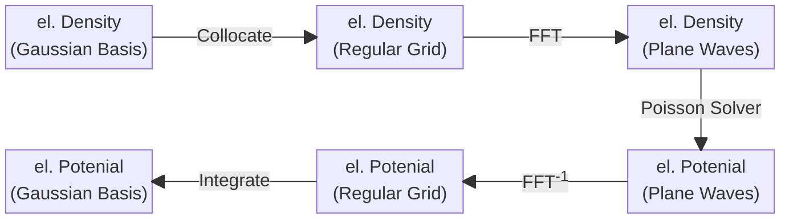

# Gaussian Plane Wave

The primary basis in CP2K consists of Gaussian Type Orbital (GTO) functions. To take advantage of
the efficient FFT algorithm for solving the Poisson equation, the electronic density must first be
transferred from the GTO representation to a regular grid. This is referred to as _collocation_.
After solving the Poisson equation the obtained electrostatic potential has to be transferred back
into the GTO basis, which is referred to as _integration_. This ”opportunistic” switching between a
Gaussian and a plane wave representation is the core idea of the Gaussian and Plane Waves (GPW)
method. Its high-level operations are illustrated in the following flowchart:



## See also

- <https://www.cp2k.org/gpw>
- <https://www.cp2k.org/quickstep>
- [](#VandeVondele2005)

```{youtube} v2vnZbhNEpw
---
url_parameters: ?start=2
align: center
privacy_mode:
---
```
