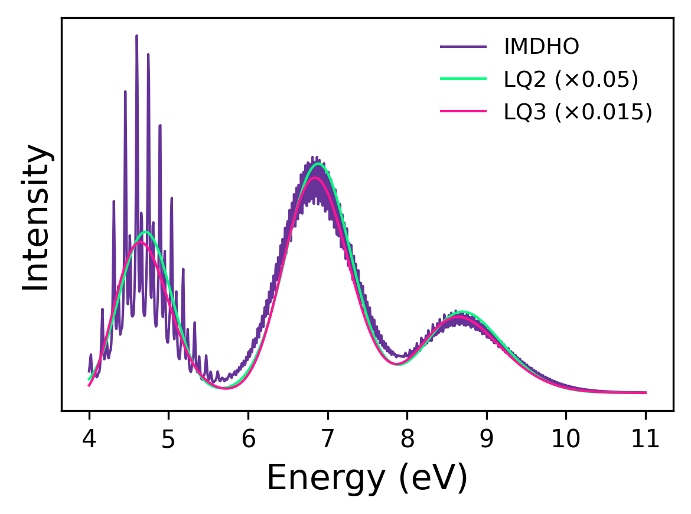

# Simulating Vibronic Effects in Optical Spectra

This tutorial demonstrates how to compute the vibronic spectra of SO$_2$ using CP2K and the
VibronicSpec post-processing tool. We'll calculate vibrational modes and excited state forces with
CP2K, then combine these results to obtain the vibronic spectrum using different theoretical
methods, as shown in the figure.

{align=center}

The methods developed are based on these publications:

- [J. Chem. Phys. 127, 164319 (2007)](https://pubs.aip.org/aip/jcp/article/127/16/164319/937415/Analysis-and-prediction-of-absorption-band-shapes)
- [J. Chem. Phys. 137, 234107 (2012)](https://pubs.aip.org/aip/jcp/article/137/23/234107/191739/Efficient-and-automatic-calculation-of-optical)
- [J. Chem. Theory Comput. 13, 2823 (2017)](https://pubs.acs.org/doi/10.1021/acs.jctc.7b00325)

## Theoretical Background

**Vibronic Transitions and the Franck-Condon Principle**

Vibronic spectra arise from transitions between electronic states that involve simultaneous changes
in both electronic and vibrational states. The intensity distribution follows the Franck-Condon
principle, which states that electronic transitions occur much faster than nuclear motions, leading
to vertical transitions where nuclei maintain their initial positions and momenta.

**Displaced Harmonic Oscillator Model**

Within the harmonic approximation, the potential energy surfaces of ground and excited states are
described as parabolas with identical curvatures (same frequencies and normal modes) but displaced
minima. The key parameter is the displacement vector $\Delta Q_k$, which represents the geometry
change between equilibrium structures along each normal mode coordinate:

$$
\Delta Q_k = \frac{1}{\omega_k^2} \frac{\partial E}{\partial Q_k}
$$

where $\omega_k$ is the vibrational frequency of mode $k$ and $\partial E/\partial Q_k$ is the
energy gradient along the normal mode coordinate.

**Huang-Rhys Factors and Relaxation Energy**

The Huang-Rhys factor $S_k$ quantifies the vibronic coupling strength for each vibrational mode $k$:

$$
S_k = \frac{1}{2}\omega_k\Delta Q_k^2
$$

Large $S_k$ values indicate strong coupling, leading to pronounced vibrational progression in the
spectrum. The total relaxation energy $\lambda = \sum_k S_k\omega_k$ represents the energy
stabilization due to geometry relaxation after electronic excitation.

**Thermal Occupation Factors**

The thermal occupation number $\bar{n}_k$ represents the average number of vibrational quanta
excited at temperature T:

$$
\bar{n}_k = \frac{1}{e^{\omega_k/k_BT} - 1}
$$

This factor accounts for thermally excited vibrational states that can participate in the
transition, with $\bar{n}_k = 0$ at zero temperature.

### Lineshape Methods

The simplest method is to calculate the vertical excitations and convolute each transition with an
empirical broadening function. This approach, however, apart from the ambiguity in the choice of the
width parameter, does not recognize the asymmetry of the vibronic band.

### IMDHO Method (Independent Mode Displaced Harmonic Oscillator)

The IMDHO method uses the time-domain correlation function formalism:

$$
\sigma(\omega) = \frac{4\pi^2\omega}{3c} f \int_{-\infty}^{\infty} dt \, e^{i(\omega - E_{ad} - \lambda)t} \prod_{k=1}^{N} \exp\left[-S_k(2\bar{n}_k+1) + S_k\bar{n}_ke^{i\omega_kt} + S_k(\bar{n}_k+1)e^{-i\omega_kt}\right]
$$

where:

- $f$ is the electronic oscillator strength,
- $E_{ad} = E_{vert} - \lambda$ is the adiabatic excitation energy.
- The product term describes the vibrational overlap for all modes,
- The exponential terms represent creation and annihilation of vibrational quanta,
- Temperature effects are included through the $\bar{n}_k$ factors.

This method provides the highest accuracy by treating each vibrational mode independently, allowing
it to capture full vibronic progression, mode-specific displacements, and temperature effects.

### LQ2 Method - Symmetric Gaussian Model (Second-Order Cumulant Expansion)

The LQ2 method is a Gaussian approximation that considers only the second spectral moment:

$$
\sigma(\omega) \propto f \exp\left[-\frac{(\omega - E_{vert})^2}{4\alpha}\right]
$$

where the linewidth parameter $\alpha$ is defined as:

$$
\alpha = \sum_k S_k\omega_k^2
$$

This method provides a symmetric lineshape and is computationally efficient but neglects spectral
asymmetry and detailed vibronic structure.

### LQ3 Method - Asymmetric Gaussian Model (Third-Order Cumulant Expansion)

The LQ3 method includes anharmonic corrections through a cubic time term:

$$
\sigma(\omega) \propto f \int dt \, e^{i(\omega - E_{vert})t} e^{-\alpha t^2 + \gamma t^3}
$$

where, in addition to the linewidth parameter $\alpha$ from above, the anharmonicity parameter
$\gamma$ then captures spectral asymmetry:

$$
\gamma = \frac{1}{12}\sum_k S_k\omega_k^3
$$

This method provides improved accuracy over LQ2 by accounting for spectral skewness while remaining
more computationally efficient than the full IMDHO calculation.

### Method Selection

The choice of method depends on the desired balance between computational cost and spectral
accuracy:

- LQ2: Very fast, suitable for preliminary calculations and systems with weak vibronic coupling.
- LQ3: Fast, captures asymmetric lineshapes.
- IMDHO: Most accurate, essential for detailed vibronic progression and temperature-dependent
  studies. Can be expensive for large systems and many excited states.

All methods utilize the same fundamental physical parameters (frequencies, displacements, Huang-Rhys
factors) but employ different levels of approximation in constructing the final spectral lineshape.

## Example: SO$_2$ molecule

In this example, we'll use SO$_2$ and calculate the vibronic spectra.

To compute the vibronic spectra, we need 2 separate CP2K calculations:

- Vibrational analysis of the ground-state
- TDDFT absorption spectrum with excited-state forces

This tutorial will not provide detailed information regarding these mentioned calculations.

Since vibronic spectroscopy methods are highly sensitive to molecular geometry, you must start from
a well-converged global minimum. The geometry file provided in this tutorial has been converged with
the [MAX_FORCE](#CP2K_INPUT.MOTION.GEO_OPT.MAX_FORCE) keyword set to `1.0E-5` to ensure it meets
this requirement. You can check the geometry by looking at the vibrational analysis. If there are
negative frequencies, the geometry might not be converged properly. For solids and liquids, however,
vibrational analysis may produce negative frequencies that require careful interpretation.

Additionally, the electronic structure calculations must use the same parameters, i.e., functional,
basis set, and convergence settings, across all calculations. The optimized geometry is specific to
the chosen computational setup, so using different parameters in vibrational analysis and spectrum
calculation could mean the geometry is no longer at the true minimum for those new settings. The
geometry in this tutorial is optimized using `PBE0` functional and `TZVP-MOLOPT-PBE0-GTH` basis
sets. [ADMM](#CP2K_INPUT.FORCE_EVAL.DFT.AUXILIARY_DENSITY_MATRIX_METHOD)[](#Guidon2010)
approximation is also used with `admm-dzp` basis to reduce the cost of exchange integrals.

### 1. Vibrational modes and frequencies

First, we calculate the vibrational spectrum using the following input. SO$_2$ molecule has 3 modes,
($3*N_\textrm{atom}-6$), therefore the [NPROC_REP](#CP2K_INPUT.VIBRATIONAL_ANALYSIS.NPROC_REP) value
should be adjusted to the requested processors. Intensities are not required.

```none
&GLOBAL
  PROJECT so2
  PRINT_LEVEL LOW
  RUN_TYPE VIBRATIONAL_ANALYSIS
&END GLOBAL

&VIBRATIONAL_ANALYSIS
  INTENSITIES F
  FULLY_PERIODIC FALSE
  NPROC_REP 6
&END VIBRATIONAL_ANALYSIS

&FORCE_EVAL
  METHOD Quickstep
  &DFT
    CHARGE            0
    MULTIPLICITY      1
    BASIS_SET_FILE_NAME BASIS_MOLOPT_UZH
    POTENTIAL_FILE_NAME POTENTIAL_UZH
    BASIS_SET_FILE_NAME BASIS_ADMM_UZH
    &QS
      METHOD GPW
      EPS_DEFAULT 1.0E-12
      MIN_PAIR_LIST_RADIUS -1.0
    &END QS
    &MGRID
       CUTOFF     600
       REL_CUTOFF  60
    &END MGRID
    &SCF
      SCF_GUESS RESTART
      EPS_SCF 1.0E-7
      MAX_SCF 20
      &OT
        MINIMIZER DIIS
        PRECONDITIONER FULL_ALL
      &END
      &OUTER_SCF
         EPS_SCF 1.0E-7
         MAX_SCF 100
      &END
    &END SCF
    &XC
      &XC_FUNCTIONAL PBE0
      &END XC_FUNCTIONAL
      &HF
         FRACTION 0.25
         &HF_INFO ON
         &END
         &INTERACTION_POTENTIAL
            POTENTIAL_TYPE TRUNCATED
            CUTOFF_RADIUS 3.0
         &END
         &SCREENING
           EPS_SCHWARZ 1.0E-10
         &END
      &END HF
    &END XC
    &AUXILIARY_DENSITY_MATRIX_METHOD
      METHOD BASIS_PROJECTION
      ADMM_PURIFICATION_METHOD NONE
      EXCH_SCALING_MODEL NONE
      EXCH_CORRECTION_FUNC PBEX
    &END
    &POISSON
      PERIODIC NONE
      POISSON_SOLVER WAVELET
    &END POISSON
  &END DFT
  &SUBSYS
    &COORD
  S         4.9999986448        4.9666767697        5.2571227806
  O         4.9999999980        6.2087412933        4.5332461336
  O         4.9999999958        3.7245960698        4.5332576512
    &END COORD
    &TOPOLOGY
      &CENTER_COORDINATES
      &END
    &END TOPOLOGY
    &CELL
      ABC 10 10 10
      ALPHA_BETA_GAMMA 90.0 90.0 90.0
      PERIODIC NONE
    &END CELL
    &KIND S
      BASIS_SET TZVP-MOLOPT-PBE0-GTH-q6
      BASIS_SET AUX_FIT admm-dzp-q6
      POTENTIAL GTH-PBE0-q6
    &END KIND
    &KIND O
      BASIS_SET TZVP-MOLOPT-PBE0-GTH-q6
      BASIS_SET AUX_FIT admm-dzp-q6
      POTENTIAL GTH-PBE0-q6
    &END KIND
  &END SUBSYS
&END FORCE_EVAL

```

From this calculation, we obtain the vibrational spectrum in `so2-VIBRATIONS-1.mol` in molden
format, which we will use for the post-processing. This file contains the atomic coordinates in
a.u., frequencies (`[FREQ]`) in $\textrm{cm}^{-1}$ and normal modes (`[FR-NORM-COORD]`) in a.u..

```none
 [Molden Format]
 [Atoms] AU
 S        1      16       9.448629       9.448646      10.132595
 O        2       8       9.448632      11.795808       8.764666
 O        3       8       9.448632       7.101454       8.764688
 [FREQ]
      463.497878
     1170.275972
     1387.344563
 [FR-COORD]
 S        9.448629       9.448646      10.132595
 O        9.448632      11.795808       8.764666
 O        9.448632       7.101454       8.764688
 [FR-NORM-COORD]
 vibration      1
    -0.000001       0.000001       0.408496
     0.000001      -0.499005      -0.409341
     0.000001       0.499004      -0.409341
 vibration      2
    -0.000001       0.000037       0.344976
     0.000001       0.566526      -0.345673
     0.000001      -0.566601      -0.345707
 vibration      3
    -0.000000      -0.520552       0.000027
     0.000001       0.521672      -0.304029
    -0.000001       0.521585       0.303974
```

### 2. Absorption spectrum and excited-state forces

The absorption spectrum and excited‑state forces can be calculated in a single run. For this, we
will change the [RUN_TYPE](#CP2K_INPUT.GLOBAL.RUN_TYPE) to `ENERGY_FORCE`, remove the
`VIBRATIONAL_ANALYSIS` section from the input above, and add the
[PROPERTIES](#CP2K_INPUT.FORCE_EVAL.PROPERTIES) section below to `FORCE_EVAL`.

```none
&PROPERTIES
  &TDDFPT
    NSTATES 10
    CONVERGENCE [eV] 1.0e-5
    ADMM_KERNEL_CORRECTION_SYMMETRIC
    &PRINT
      &FORCES
        THRESHOLD 0.01
      &END
    &END PRINT
  &END TDDFPT
&END PROPERTIES
```

For this example, we’ll request 10 excited states, which captures the energy range relevant to our
spectrum. For other molecules, this number should be adjusted based on the system size and the
energy range of interest. We also set the excitation convergence to $10^{-5}$ eV, making it tighter
than the default, to ensure more accurate excitation energies. We also ask to print the forces, and
we set a [THRESHOLD](#CP2K_INPUT.FORCE_EVAL.PROPERTIES.TDDFPT.PRINT.FORCES.THRESHOLD) of 0.001. This
means forces are only calculated for states whose oscillator strength is above that value. Filtering
out weak states helps keep the calculation efficient. You can also list specific states explicitly
with the [LIST](#CP2K_INPUT.FORCE_EVAL.PROPERTIES.TDDFPT.PRINT.FORCES.LIST) keyword (\[Strand2019\],
[](#Iannuzzi2005), \[Hehn2022\]).

The output file we need is `so2-TDFORCE-1_0.tdfrc` file, which contains the spectrum data and the
forces in this format:

```none
  # STATE NR.   1               4.42928 eV       Oscillator strength:  0.0018782
           3

       -0.00000011533194       -0.00001147372289        0.08283325195246
       -0.00000003787961        0.08521318053390       -0.03995448825912
       -0.00000002363537       -0.08518437233452       -0.04121974562195
  # STATE NR.   2               4.73217 eV       Oscillator strength:  0.0000000
  # STATE NR.   3               6.88229 eV       Oscillator strength:  0.0266649
           3

       -0.00000029284682       -0.00000325607886        0.16080039585134
        0.00000007170914        0.09720148772146       -0.07996409950757
        0.00000007474609       -0.09720032431716       -0.07989742343589
  # STATE NR.   4               8.59178 eV       Oscillator strength:  0.0000123
  # STATE NR.   5               8.82238 eV       Oscillator strength:  0.0000000
  # STATE NR.   6               8.96389 eV       Oscillator strength:  0.0508470
           3

       -0.00000000259255       -0.00000738331081       -0.01039580009444
       -0.00000007113333        0.13252622525927        0.00524117205768
       -0.00000007174747       -0.13251465091338        0.00488212051205
  # STATE NR.   7               9.69782 eV       Oscillator strength:  0.0000220
  # STATE NR.   8               9.73440 eV       Oscillator strength:  0.0066963
           3

       -0.00000037994327       -0.00002119798164        0.20468077319361
        0.00000011356579        0.10583044117747       -0.10298557213750
        0.00000011155504       -0.10580720493312       -0.10318459031726
  # STATE NR.   9               9.77699 eV       Oscillator strength:  0.0000000
  # STATE NR.  10              10.99706 eV       Oscillator strength:  0.0150407
           3

       -0.00000061611618        0.00000032773220        0.30829793267287
        0.00000029373336        0.08008916703722       -0.15453299977376
        0.00000029256088       -0.08010428717480       -0.15324331957030
```

The forces for the states with an intensity higher than the cutoff are calculated and printed,
whereas less intense states are skipped.

### 3. Calculating vibronic spectrum

We will use the python package [VibronicSpec](https://github.com/cp2k/cp2k/tree/master/tools) that
can be found in CP2K tools. An example config.toml file is provided. We will modify it for the
SO$_2$ molecule.

```none
[files]
vibrations_filename = "so2-VIBRATIONS-1.mol"
output_filename = "so2_spectrum.txt"
force_filename = "so2-TDFORCE-1_0.tdfrc"

[calculation]
# Single key. Choose one format:
# states = "all"                    # Use all available states with forces
# states = [1, 2, 6]               # Explicit state list  
states = "threshold:0.001"        # Filter oscillator strength by threshold

energy_min = 4                 # in eV
energy_max = 11                # in eV
energy_points = 1000
method = "lq2"
spectrum_type = "absorption"
stokes_shift = 0.0

[output]
print_individual_states = false

[imdho]
temperature = 298                        # in K
gamma_broadening = 0.012398418754199978  # in eV
theta_broadening = 0.0

[integration]
max_time_slices = 5000
lq3_time_step = 30
lq3_convergence = 0.0000001
imdho_time_step = 30
imdho_convergence = 0.000000001
cutoff_energy = 0.0816
```

The CP2K output files from the vibrational analysis and the TDDFT forces should be provided. Key
calculation parameters are:

- Energy range (in eV)
- Number of points for the spectrum
- Method (LQ2, LQ3, or IMDHO)
- Spectrum type (absorption or fluorescence)
- States to include, it can take different arguments:
  - "all", includes all states that have forces in TDFORCE file
  - a list like \[1, 2, 5\] to explicitly give state numbers
  - "threshold:0.001", this option works like the THRESHOLD filter we used in the TDDFT force
    calculation, including only states with oscillator strength above 0.001.

Optional sections provide defaults for method‑specific settings. For the IMDHO method, you can set
the temperature (in K) for thermal occupation factors and also the gamma broadening (in eV).
Integration parameters control the time integrations required for LQ3 and IMDHO. The defaults are
tuned values and they should be used unless you know what you’re doing. The final output is a
spectrum summed over all included states. If you want to see each state separately, set
`print_individual_states = true`.

VibronicSpec will print information regarding the calculation, such as the states filtered, which
should be checked. It will also print the progression, and total runtime.

The figure above shows the calculated absorption spectrum of SO$_2$ using all three methods using
the provided input, only changing the method. The LQ2 methods gives a simple Gaussian profile
without the vibronic structure. The LQ3 methods adds a cubic coupling through time integration,
revealing some shoulder features. The IMDHO method (calculated at 298 K) includes full mode-by-mode
displacement and temperature effects, producing the most detailed spectrum. The LQ2 and LQ3
intensities are scaled to align with the IMDHO peak for visual comparison. For reference, for this
particular example, if LQ2 takes one unit of time, then LQ3 and IMDHO will take about 800× longer
for this molecule with the given setup. In practice, timings scale with the number of excited
states, vibrational modes, and spectral resolution.
