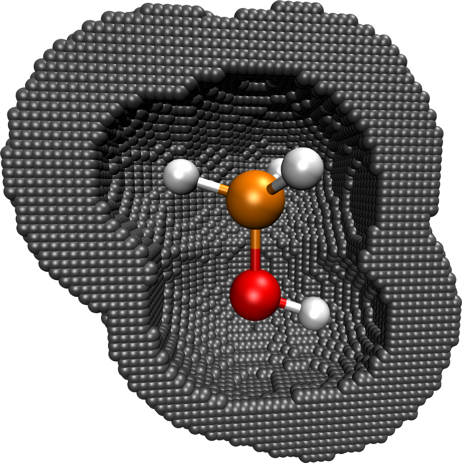
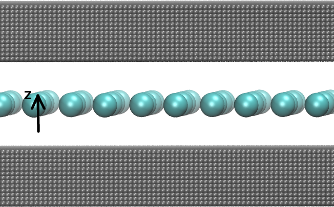
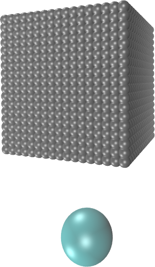
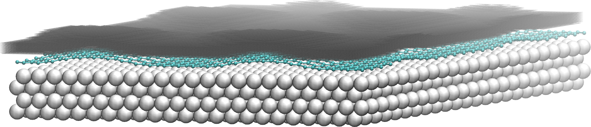

# RESP Charges

## Introduction

In CP2K, Restrained Electrostatic Potential (RESP) charges can be fitted for periodic and
nonperiodic systems. It is automatically decided by the program whether a periodic or nonperiodic
RESP fit is carried out. If the electrostatic (Hartree) potential is periodic (i.e. a periodic
Poisson solver is used), a periodic RESP fit is performed. If the Hartree potential is computed
using a nonperiodic Poisson solver, the nonperiodic fitting is employed. In any case, a least
squares fitting procedure at defined grid points $\mathbf{r}_k$ is carried out,

$$
R_\mathrm{esp}=\frac{1}{N}\sum_k^N{(V_\mathrm{QM}(\mathbf{r}_k)-V_\mathrm{RESP}(\mathbf{r}_k))^2},
$$

where $V_\mathrm{QM}$ is the quantum mechanical (QM) potential and $V_\mathrm{RESP}$ the potential
generated by the RESP charges. $N$ is the number of selected fit points.

### Nonperiodic fitting

The fitted potential is obtained from a set of point charges $\{q_a\}$ centered at atom $a$
according to

$$
V_\mathrm{RESP}(\mathbf{r}_k) = \sum_a\frac{q_a}{|\mathbf{R}_a-\mathbf{r}_k|}.
$$

For more details see:
[J. Phys. Chem., 97 , 10269-10280 (1993).](https://dx.doi.org/10.1021/j100142a004)

### Periodic fitting

The fitted potential is generated from the charge distribution $\rho$,

$$
\rho(\mathbf{r})=\sum_a{q_a g_a(\mathbf{r},\mathbf{R}_a)},
$$

where $g_a$ is a Gaussian function centered at atom $a$. The periodic fitting is embedded in a
Gaussian and plane waves (GPW) framework and described in detail in
[Phys. Chem. Chem. Phys., 17 , 14307-14316 (2015).](https://dx.doi.org/10.1039/C4CP04638B) In the
periodic case, CP2K offers also the possibility to fit the variance of the potential instead of the
absolute values, see [below](#repeat_method).

## Basic input

The RESP fitting is a post-SCF step and included as a subsection of the
[PROPERTIES](#CP2K_INPUT.FORCE_EVAL.PROPERTIES) section.

```none
&PROPERTIES
  &RESP
     &SPHERE_SAMPLING
     &END
  &END RESP
&END PROPERTIES
```

With this basis setup, the following defaults are employed:

- All points outside the van der Waals radii (taken from the Cambridge database) of the atoms are
  included
- The total charge of the system as defined in [CHARGE](#CP2K_INPUT.FORCE_EVAL.DFT.CHARGE) is
  retained, i.e. [INTEGER_TOTAL_CHARGE](#CP2K_INPUT.FORCE_EVAL.PROPERTIES.RESP.INTEGER_TOTAL_CHARGE)
  is set to `.TRUE.` by default.
- All atoms except the hydrogens are weakly restrained to zero, i.e.
  [RESTRAIN_HEAVIES_TO_ZERO](#CP2K_INPUT.FORCE_EVAL.PROPERTIES.RESP.RESTRAIN_HEAVIES_TO_ZERO) is set
  to `.TRUE.` by default.

## Sampling of fit points

There are different options to sample the fit points. The fit points can be sampled in
shells/spheres around the atoms or, for slab-like systems, in a certain range above the surface. In
any case, the systems and the sampled fitting points can be printed as .xyz file and visualized
with, e.g. VMD, by enabling:

```none
&RESP
  ....
  &PRINT
    &COORD_FIT_POINTS
    &END
  &END 
&END RESP
```

For better visualization it is recommended to center the coordinates of the systems using
[CENTER_COORDINATES](#CP2K_INPUT.FORCE_EVAL.SUBSYS.TOPOLOGY.CENTER_COORDINATES).

### Sphere sampling

{align=center width=350px} **Figure 1.** Methanol molecule and fitting
points (gray) sampled.

This type of sampling is employed for isolated molecules and porous periodic structures suchs as
metal-organic frameworks (MOFs). All grid points within a given spherical shell around the atom are
included in the fitting, see Figure 1. The spherical shells are defined by a minimal radius
$r_\mathrm{min}$ and a maximal radius $r_\mathrm{max}$. The paramters $r_\mathrm{min}$ and
$r_\mathrm{max}$ can be defined specifically for each element and are, by default, based on the van
der Waals (vdW) radii. For the vdW radii, the values from the Cambridge Structural Database
`CAMBRIDGE` or the Universal Force Field `UFF` can be specified via
[AUTO_VDW_RADII_TABLE](#CP2K_INPUT.FORCE_EVAL.PROPERTIES.RESP.SPHERE_SAMPLING.AUTO_VDW_RADII_TABLE).
Using the keywords
[AUTO_RMIN_SCALE](#CP2K_INPUT.FORCE_EVAL.PROPERTIES.RESP.SPHERE_SAMPLING.AUTO_RMIN_SCALE) and
[AUTO_RMAX_SCALE](#CP2K_INPUT.FORCE_EVAL.PROPERTIES.RESP.SPHERE_SAMPLING.AUTO_RMAX_SCALE),
$r_\mathrm{min}$ and $r_\mathrm{max}$ are then calculated as follows:

- $r_\mathrm{min}$ = AUTO_RMIN_SCALE $\cdot$ vdW_radius
- $r_\mathrm{max}$ = AUTO_RMAX_SCALE $\cdot$ vdW_radius

These settings can be overwritten for all atoms using the keywords
[RMIN](#CP2K_INPUT.FORCE_EVAL.PROPERTIES.RESP.SPHERE_SAMPLING.RMIN) and
[RMAX](#CP2K_INPUT.FORCE_EVAL.PROPERTIES.RESP.SPHERE_SAMPLING.RMAX) or only for specific atoms using
[RMIN_KIND](#CP2K_INPUT.FORCE_EVAL.PROPERTIES.RESP.SPHERE_SAMPLING.RMIN_KIND) and
[RMAX_KIND](#CP2K_INPUT.FORCE_EVAL.PROPERTIES.RESP.SPHERE_SAMPLING.RMAX_KIND). In the following
example, $r_\mathrm{min}$ is overwritten for all carbon atoms to 2.1$\,\mathring{\mathrm{A}}$.

```none
&SPHERE_SAMPLING
  AUTO_VDW_RADII_TABLE CAMBRIDGE
  AUTO_RMIN_SCALE 1.0
  AUTO_RMAX_SCALE 10.0
  RMIN_KIND 2.1 C
&END
```

### Slab sampling

RESP charges can be also fitted for slab-like systems. In this case, the potential should be well
reproduced above the surface where, e.g., adsorption processes take place. The input for a flat
monolayer, see Figure 2, is for example:

{align=center width=450px} **Figure 2.** Flat monolayer and fitting
points (gray).

```none
&SLAB_SAMPLING
  RANGE 1.0 3.0
  ATOM_LIST 1..32
  SURF_DIRECTION Z
&END
&SLAB_SAMPLING
  RANGE 1.0 3.0
  ATOM_LIST 1..32
  SURF_DIRECTION -Z
&END
```

{align=center width=150px} **Figure 3.** Fit points sampled over
surface atom.

Here, the system is 2D-periodic in the xy-dimensions and the fitting points are sampled above
(+z-direction) and below (-z-direction) which is specified by
[SURF_DIRECTION](#CP2K_INPUT.FORCE_EVAL.PROPERTIES.RESP.SLAB_SAMPLING.SURF_DIRECTION). With the
keyword [ATOM_LIST](#CP2K_INPUT.FORCE_EVAL.PROPERTIES.RESP.SLAB_SAMPLING.ATOM_LIST) the atoms that
constitute the surface are defined. This list should contain indexes of atoms of the first surface
layer. [RANGE](#CP2K_INPUT.FORCE_EVAL.PROPERTIES.RESP.SLAB_SAMPLING.RANGE) defines that the points
are sampled between 1-3 $\mathring{\mathrm{A}}$ above the surface layer.

The sampling technique is flexible enough to follow a corrugation of the surface. The sampling
technique works as follows: An orthogonal box with box length $abc$ is constructed over each surface
atom, see Figure 3. All fitting points within this box are included in the fitting. The height $c$
of the box is defined by the keyword
[RANGE](#CP2K_INPUT.FORCE_EVAL.PROPERTIES.RESP.SLAB_SAMPLING.RANGE) . The length $a=b$ are given by
the keyword [LENGTH](#CP2K_INPUT.FORCE_EVAL.PROPERTIES.RESP.SLAB_SAMPLING.LENGTH). For flat surface
layers, [LENGTH](#CP2K_INPUT.FORCE_EVAL.PROPERTIES.RESP.SLAB_SAMPLING.LENGTH) is set to a
sufficiently large values (3 $\mathring{\mathrm{A}}$ or more). For corrugated surface layers,
[LENGTH](#CP2K_INPUT.FORCE_EVAL.PROPERTIES.RESP.SLAB_SAMPLING.LENGTH) should be in the range of the
distance between the surface atoms.

An input example for a corrugated graphene layer on ruthenium, see Figure 4, is given below.
[ATOM_LIST](#CP2K_INPUT.FORCE_EVAL.PROPERTIES.RESP.SLAB_SAMPLING.ATOM_LIST) lists in this case the
indexes of the carbon atoms.

{align=center width=550px} **Figure 4.** Corrugated graphene layer
on ruthenium and fitting points (gray).

```none
&SLAB_SAMPLING
  RANGE 2.0 4.0
  LENGTH 2.0
  ATOM_LIST 1..1250
  SURF_DIRECTION Z
&END
```

## Constraints

A constraint on the total charge of the system is introduced by the keyword
[INTEGER_TOTAL_CHARGE](#CP2K_INPUT.FORCE_EVAL.PROPERTIES.RESP.INTEGER_TOTAL_CHARGE), which is set by
default to `.TRUE.`. Further explicit constraints can be given via the subsection
[CONSTRAINT](#CP2K_INPUT.FORCE_EVAL.PROPERTIES.RESP.CONSTRAINT). It is possible to enforce the same
charges for chemically equivalent atoms, e.g. for the hydrogen atoms of a methyl group. The
corresponding input is:

```none
&CONSTRAINT
  EQUAL_CHARGES
  ATOM_LIST 1 2 3
&END
```

where [ATOM_LIST](#CP2K_INPUT.FORCE_EVAL.PROPERTIES.RESP.CONSTRAINT.ATOM_LIST) lists the indexes of
the atoms that should have the same charge.

The definition of more elaborate constraints is also possible. The constraints are always linear
following the formula $\sum_i^{N_\text{list}}c_i q_i=t$. The sum is running over the atoms given in
[ATOM_LIST](#CP2K_INPUT.FORCE_EVAL.PROPERTIES.RESP.CONSTRAINT.ATOM_LIST) and $t$ is the target value
of the constraint given by [TARGET](#CP2K_INPUT.FORCE_EVAL.PROPERTIES.RESP.CONSTRAINT.TARGET). The
coefficients $\{c_i\}$ are defined by the keyword
[ATOM_COEF](#CP2K_INPUT.FORCE_EVAL.PROPERTIES.RESP.CONSTRAINT.ATOM_COEF). With the following input
it is achieved that the (absolute value) of the charge on atom 3 is twice as large as the charge on
atom 5, i.e. $q_3=2q_5$.

```none
&CONSTRAINT
  ATOM_LIST 3 5
  ATOM_COEF 1.0 -2.0
  TARGET 0.0
&END
```

## Restraints

To avoid unphysical values for the fitted charges, restraints can be set. The restraints in CP2K are
addressed by harmonic penalty functions,

$$
R_\mathrm{rest} = \beta \sum_j (q_j-t_j)^2,
$$

where $t_j$ is the target value for charge $q_j$ and $\beta$ is the strength of the restraint. By
default, all elements except hydrogen are weakly restrained to zero, i.e. the keyword
[RESTRAIN_HEAVIES_TO_ZERO](#CP2K_INPUT.FORCE_EVAL.PROPERTIES.RESP.RESTRAIN_HEAVIES_TO_ZERO) is set
to `.TRUE.` by default. The strength of this restraint is controlled by
[RESTRAIN_HEAVIES_STRENGTH](#CP2K_INPUT.FORCE_EVAL.PROPERTIES.RESP.RESTRAIN_HEAVIES_STRENGTH).
Restraints can be also defined explicitly via the subsection
[RESTRAINT](#CP2K_INPUT.FORCE_EVAL.PROPERTIES.RESP.RESTRAINT):

```none
&RESP
  ...
  &RESTRAINT
    ATOM_LIST 1..3
    TARGET -0.18
    STRENGTH 0.0001
  &END
  &RESTRAINT
    ATOM_LIST 4
    TARGET 0.21
    STRENGTH 0.0001
  &END
  RESTRAIN_HEAVIES_TO_ZERO .FALSE.
&END RESP
```

In this example, charges on atoms with indexes 1..3 are restrained to -0.18 and the charge on atom 4
to 0.21. The target values $t_j$ of the restraints can be, e.g., inspired from DDAPC, Mulliken
charges etc. The strength $\beta$ of the restraint is defined by
[STRENGTH](#CP2K_INPUT.FORCE_EVAL.PROPERTIES.RESP.RESTRAINT.STRENGTH). Large values for $\beta$ will
limit increasingly the flexibility of the charge fitting and decrease the quality of the fit. If
only the explicitly given restraints should be used,
[RESTRAIN_HEAVIES_TO_ZERO](#CP2K_INPUT.FORCE_EVAL.PROPERTIES.RESP.RESTRAIN_HEAVIES_TO_ZERO) must be
switched to `.FALSE.`.

(repeat_method)=

## Fitting the variance (REPEAT method)

CP2K offers also the possibility to fit the variance of the potential as proposed in
[](#Campana2009). This is only valid for periodic systems, since the reference state of the ESP is
arbitrary in the periodic case. The modified residual reads:

$$
R_\mathrm{repeat}=\frac{1}{N}\sum_k^N{(V_\mathrm{QM}(\mathbf{r}_k)-V_\mathrm{RESP}(\mathbf{r}_k)-\delta)^2},
$$

where

$$
\delta = \frac{1}{N}\sum_k^N(V_\mathrm{QM}(\mathbf{r}_k)-V_\mathrm{RESP}(\mathbf{r}_k)).
$$

When $V_\mathrm{QM}$ is obtained from, e.g., a plane wave code and the periodicity of
$V_\mathrm{RESP}$ is later treated by, e.g., Ewald summation, both potentials will have different
offsets. The modified residual $R_\mathrm{repeat}$ was introduced to overcome this problem. In CP2k,
$V_\mathrm{QM}$ and $V_\mathrm{RESP}$ are both evaluated with the same method, the GPW approach, and
have thus the same offset. However, fitting the variance of the potential is an easier task than
fitting the absolute values and avoids a strong fluctuation of the charges. A stabilization of the
fitting procedure is thus also expected in CP2K when $\delta \ne 0$. The value of $\delta$ depends
on the sampling of fitting points. If all points are included, it strictly holds that $\delta=0$,
since we have $\sum_k^{N_{all}}V(r_k)=0$ (in CP2K). In this case, the original and modified
residuals are identical, i.e. $R_\mathrm{esp}=R_\mathrm{repeat}$. If the fitting points are sampled
in spheres around the atom, which is done for molecular periodic structures like MOFs, $\delta$ will
be non-zero and fitting the variance is strongly recommended. When sampling the fitting points above
a surface, we often find that $\delta\sim0$. However, minimizing $R_\mathrm{repeat}$ will partly
also yield improvements for such systems.

To enable this option, add the keyword
[USE_REPEAT_METHOD](#CP2K_INPUT.FORCE_EVAL.PROPERTIES.RESP.USE_REPEAT_METHOD):

```none
&RESP
  ...
  USE_REPEAT_METHOD
&END RESP
```

Note that
[RESTRAIN_HEAVIES_TO_ZERO](#CP2K_INPUT.FORCE_EVAL.PROPERTIES.RESP.RESTRAIN_HEAVIES_TO_ZERO) is then
automatically switched to `.FALSE.`. Furthermore, the definition of explicit restraints is usually
not necessary.

To obtain *REPEAT charges* in a stricter sense, i.e. as computed by the
*[REPEAT code](https://bitbucket.org/ccampana/repeat_atomic_charges)*, sphere sampling has to be
enabled, the van der Waals radii must be retrieved from the Universal Force Field and the total
charge must be retained. The corresponding input is

```none
&RESP
  USE_REPEAT_METHOD
  &SPHERE_SAMPLING
     AUTO_VDW_RADII_TABLE UFF
   &END
&END RESP
```

Use the keyword
[AUTO_RMIN_SCALE](#CP2K_INPUT.FORCE_EVAL.PROPERTIES.RESP.SPHERE_SAMPLING.AUTO_RMIN_SCALE) and
[AUTO_RMAX_SCALE](#CP2K_INPUT.FORCE_EVAL.PROPERTIES.RESP.SPHERE_SAMPLING.AUTO_RMAX_SCALE) to scale
the van der Waals radii as described above. Note that small numerical deviations compared to the
*REPEAT code* are possible since the fitting is embedded in a GPW framwork as described in
[Phys. Chem. Chem. Phys., 17 , 14307-14316 (2015)](https://dx.doi.org/10.1039/C4CP04638B) , whereas
the *REPEAT code* uses Ewald summation.

## Check the quality of the fit

A measure for the quality of the fit are the root-mean square (RMS) error

$$
\mathrm{RMS}=\sqrt{\frac{\sum_k^N~(V_{\mathrm{QM}}(\mathbf{r}_k)-V_\mathrm{RESP}(\mathbf{r}_k))^2}{N}}
$$

and the relative root-mean square (RRMS) error

$$
\mathrm{RRMS}=\sqrt{\frac{\sum_k^N~(V_\mathrm{QM}(\mathbf{r}_k)-V_\mathrm{RESP}(\mathbf{r}_k))^2}{\sum_k^N~V_\mathrm{QM}(\mathbf{r}_k)^2}}.
$$

Both errors are printed to the output file. They should be as small as possible. Typical values can
be found here:

- [J. Phys. Chem., 97 , 10269-10280 (1993).](https://dx.doi.org/10.1021/j100142a004)
- [J. Phys. Chem. A, 114 , 10225-10233 (2010).](https://dx.doi.org/10.1021/jp103944q)
- [Phys. Chem. Chem. Phys., 17 , 14307-14316 (2015).](https://dx.doi.org/10.1039/C4CP04638B)

When the variance is fitted, $V_\mathrm{RESP}$ is shifted by $\delta$ with respect to
$V_\mathrm{QM}$. Thus, $V_\mathrm{RESP}$ is replaced by
$\tilde{V}_\mathrm{RESP}=V_\mathrm{RESP}+\delta$ in the formulas for the RMS and RRMS values.

The RESP potential can be printed in cube file format using the following option:

```none
&RESP
  ....
  &PRINT
    &V_RESP_CUBE
    &END
  &END 
&END RESP
```

The QM potential can be as well printed as cube file using
[V_HARTREE_CUBE](#CP2K_INPUT.FORCE_EVAL.DFT.PRINT.V_HARTREE_CUBE). The cube files can be visualized
with, e.g. VMD, and the RESP and the QM potential can be directly compared. Note that
$\tilde{V}_\mathrm{RESP}$ is printed instead of $V_\mathrm{RESP}$ when the variance is fitted.

## Example input files

- Isolated methanol molecule - nonperiodic fit:
  [methanol_nonperiodic.tar.gz](https://www.cp2k.org/_media/howto:methanol_nonperiodic.tar.gz)
- Metal-organic framework IRMOF-1 - periodic fit using REPEAT:
  [irmof-1_REPEAT.tar.gz](https://www.cp2k.org/_media/howto:irmof-1_repeat.tar.gz)
- Metal-organic framework MIL-53-Al - periodic fit using REPEAT:
  [mil-53-al-repeat.tar.gz](https://www.cp2k.org/_media/howto:mil-53-al-repeat.tar.gz)
- Graphene on Ru(0001) - periodic fit:
  [graphene_Ru.tar.gz](https://www.cp2k.org/_media/howto:graphene_ru.tar.gz)
