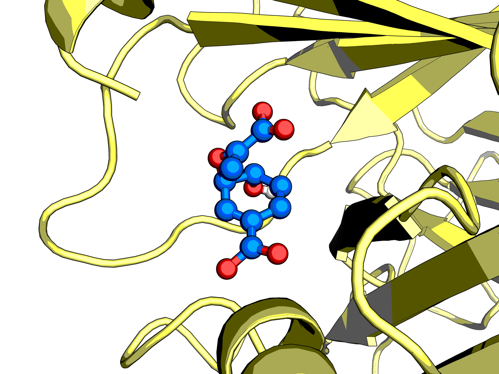
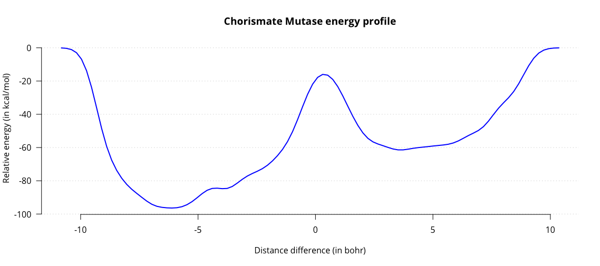
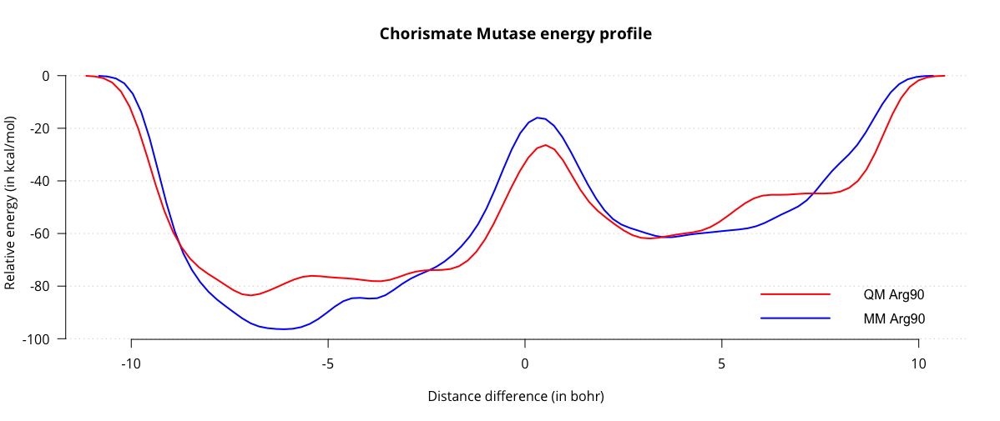

# QM/MM with Built-in Force Field

This tutorial will illustrate the setup process of a QM/MM protein - substrate system. The model
system we will be using is chorismate mutase, an enzyme that catalyzes the conversion of chorismate
to prephenate, which is a critical reaction in the shikimate pathway. One attractive feature of this
enzyme is that it catalyzes the reaction in an electrostatic manner, without forming covalent bonds
to the substrate. This allows us to treat the complete enzyme at the computationally cheap MM level,
saving us the headache of setting up bonds across the QM/MM border. In the production simulations we
will simulate the substrate at the QM level (using the semi-empirical AM1 method), but we will first
equilibrate our system with all components at the MM level.

```{note}
The input files can be downloaded [here](https://www.cp2k.org/_media/:howto:inputfiles.zip).
```

{align=center}

**Figure:** The enzyme Chorismate Mutase with its native substrate

Before we can get started on the simulations, however, we need to provide CP2K with the proper input
files. The coordinates for the chorismate mutase system can be obtained from the protein data bank
under PDB ID 2CHT. The active complex consists of three protein subunits, forming three active
sites, each of which catalyzes the reaction separately from the others. The PDB structure, however,
contains twelve units with twelve inhibitors bound. In order to generate one functional complex, we
need to remove the excess protein subunits and their inhibitors. In addition, the inhibitors bound
to the crystal structure have to be replaced with copies of the substrate, using your favourite
molecular editor. For this tutorial, all input files have been prepared for you.

## Generating a topology

Now that we have our coordinates, we need to use them to generate a topology that CP2K can use. CP2K
supports CHARMM-type PSF files and Amber-type prmtop files. I will be using
[Ambertools](https://ambermd.org/#AmberTools) to generate the input. Small molecule parametrization
for the GAFF2 forcefield is performed with Antechamber and parmchk2. Charges are derived with the
bcc method. Antechamber generates MM parameters for small molecules while parmchk2 verifies this
topology, reports missing parameters and outputs a best guess for these in an .frcmod file. For the
purposes of this tutorial, we will take the parameters straight from antechamber/parmchk2, but for
production simulations these should be examined cautiously. As the active complex has three ligands,
we will perform this parameterization for each of them in a bash loop.

```none
for i in A B C; do antechamber -i Lig${i}.mol2 -o Ligand${i}.mol2 -fi mol2 -fo mol2 -c bcc -pf yes -nc -2 -at gaff2 -j 5 -rn CH${i}; done
for i in A B C; do parmchk2 -i Ligand${i}.mol2 -f mol2 -o Ligand${i}.frcmod -s 2; done
```

We will then use tleap to load in all the parameters from antechamber and parmchk2, generate
parameters for the protein according to the Amber14 forcefield and combine everything into a
complex. The commands for tleap can be placed in an input file and ran using `tleap -f script.in`.

```none
source leaprc.protein.ff14SB
source leaprc.gaff2
source leaprc.water.tip3p

ligA = loadmol2 LigandA.mol2
ligB = loadmol2 LigandB.mol2
ligC = loadmol2 LigandC.mol2

loadamberparams LigandA.frcmod
loadamberparams LigandB.frcmod
loadamberparams LigandC.frcmod


protein = loadPDB Protein.pdb
complex = combine {protein ligA ligB ligC}
```

Now that we have assembled our complex, we have to solvate it. For simplicity's sake, we will use a
cubic box with water extending out 14 A from the protein and neutralize with Na+ ions. The distance
is determined by the cutoffs for nonbonded interactions, plus some buffer to account for cell
shrinking. For production simulations you may want to switch to a dodecahedron or octahedron for
increased efficiency.

```none
solvateBox complex TIP3PBOX 14.0 iso
addIonsRand complex  Na+ 0
saveamberparm complex complex.prmtop complex.inpcrd
quit
```

These two files contain everything we need to get started. Complex.prmtop contains the topology
information and complex.inpcrd contains the coordinates. Using your favourite visualisation tool,
check that the Na+ ions did not get placed right next to your ligand - their placement is random.
The box size can be found at the bottom of the inpcrd file, followed by the vectors. These
dimensions should be specified in the [CELL](#CP2K_INPUT.FORCE_EVAL.SUBSYS.CELL) subsection of your
input file.

## Equilibration at MM level

We can now move on to actually running CP2K. We will first run 1000 steps of energy minimization (or
fewer, depending on the convergence) with the input file `em.inp` to eliminate bad contacts. For
quantities like cell size, for instance, CP2K allows you to specify your units by placing them in
brackets, for instance [TIMESTEP](#CP2K_INPUT.MOTION.MD.TIMESTEP) \[fs\] 0.5.

```none
cp2k can be run using a single process:
cp2k.sopt em.inp > em.out

or using several processes, where N is the number of processes:
mpirun -np N cp2k.popt em.inp > em.out
```

Visualize your simulation to check for any abnormalities. Take a look at the output file, paying
extra attention to any warnings you might receive. Note: CP2K will warn you about missing forcefield
terms. You can have CP2K output these using [FF_INFO](#CP2K_INPUT.FORCE_EVAL.MM.PRINT.FF_INFO). In
this case, the missing terms are Urey-Bradley interactions. This is normal, as the Amber force field
we are employing here does not use Urey-Bradley terms. A second warning states that our CRD file
lacks velocities and box information will not be read. This is not a problem either, as we do not
have velocities at this moment and box parameters are provided in the input file.

In the next step we will perform 5 ps of dynamics in the NVT ensemble, to equilibrate the
temperature of our simulation using this `nvt.inp`. We are using the
[EXT_RESTART](#CP2K_INPUT.EXT_RESTART) section to restart with the last coordinates of the energy
minimization procedure. Once the simulation has finished, take a look at the temperature file
`NVT-1.PARTICLES.temp` to check that the temperature is oscillating around the correct value (in
this case, 298K). Note that we are using the CSVR thermostat with a low time constant of 10 fs to
efficiently and quickly control the system temperature. For production simulations a higher time
constant such as 100 fs should be chosen to avoid interfering with the dynamics of the system.

The next step is simulating our system in the constant pressure NPT ensemble to get the correct
dimensions for our cell. `npt.inp` runs 50 ps of NPT, outputting the cell dimensions into a separate
file every 100 timesteps. A C-C distance in of the chorismate molecules is constrained, in order to
keep it near the reactive conformation to facilitate our later simulations in the QM/MM phase.
Pressure control is achieved by adding a barostat with a reference pressure of 1 bar and a coupling
time of 100fs, and changing [ENSEMBLE](#CP2K_INPUT.MOTION.MD.ENSEMBLE) from NVT to NPT_I, indicating
that the box will be scaled isotropically. We expect our cell to shrink at first, as the solvation
procedure cannot fill up the cell completely due to overlap with the protein and the edges of the
box. After a while the cell size should stabilize. Take a look at the cell dimensions in `NPT.cell`;
we will be using these equilibrated cell dimensions for the next tutorial.

Congratulations, you should now have a fully equilibrated MM system. We will now move on to QM/MM to
simulate the bond-breaking process.We will also bias our simulation to ensure that we can see the
conversion of chorismate into prephenate occur in a reasonable timeframe.

## Moving on to QMMM

{align=center}

**Figure:** Chorismate(left) is converted into prephenate(right) by Chorismate Mutase

As chorismate mutase performs its catalytic function through noncovalent interactions, we can afford
to treat the entire enzyme at the MM level. For most biochemistry problems, the boundary will not be
so clear and key residues will need to be treated at the QM level as well. This means the QM - MM
border will cut through covalent bonds, necessitating the use of link atoms. For our simple system
however, this is not necessary. We first have to specify which atoms should be treated at the QM
level using the [QM_KIND](#CP2K_INPUT.FORCE_EVAL.QMMM.QM_KIND) section:

```none
&QM_KIND O
  MM_INDEX 5668 5669 5670 5682 5685 5686
&END QM_KIND
&QM_KIND C
  MM_INDEX 5663 5666 5667 5671 5673 5675 5676 5678 5680 5684
&END QM_KIND
&QM_KIND H
  MM_INDEX  5664 5665 5672 5674 5677 5679 5681 5683
&END QM_KIND
```

Now that the QM atoms are defined, CP2K needs to know how to treat these. We will use the
semi-empirical AM1 method as our QM method, electrostatically embedded in the MM system:
[E_COUPL](#CP2K_INPUT.FORCE_EVAL.QMMM.E_COUPL) `COULOMB`. This allows for the QM region to be
polarized by the MM environment. Mechanical embedding, where the QM region only interacts with the
MM region as point charges and no polarization occurs, can be selected through `E_COUPL NONE`. In
DFT calculations, the highly efficient [GEEP](#Laino2005) method can be used as well.

Before running the QM/MM simulation we need to amend our prmtop file, because in the classical
forcefield, several hydrogen atom types do not have separate Lennard-Jones parameters or they are
set up to 0.0. The AMBER FF atom types are HO (from the TIP3P water model), HG (from serine,
threonine and tyrosine residues). This will cause unphysical interactions with the QM region and the
simulation will fail due for stability reasons. The hydrogen atoms with these atom types will
strongly interact with the QM electron clouds, eventually crashing the system. To prevent this from
happening, we have to add the correct LJ parameters to the mentioned atom types using the ambertools
utility parmed.

Parmed reads the prmtop file and allows you to modify the parameters defined in it. The parmed
command we are going to use is: `changeLJSingleType`, which changes the LJ type for all of the atoms
that share the LJ type, or `addLJType`, for more selective modifications. We will change their LJ
parameters to those of a GAFF2 type alcohol that has `0.3019 0.047` values for the LJ type.

Either if we are using `changeLJSingleType` or `addLJType`, we need to ensure that we are changing
the right atom index. To do so, we need to use `printDetails` or `printLJTypes` that print the
information on the selected atom index.

```none
$ parmed complex.prmtop
changeLJSingleType :WAT@H1 0.3019 0.047
changeLJSingleType :*@HO 0.3019 0.047
outparm complex_LJ_mod.prmtop
quit
```

The input file `monitor.inp` will perform 5 ps of simulation in the NVT ensemble. Note that the
parameter file should be changed to our modified file with LJ sites on the OH hydrogens. We have
also defined a collective variable (CV), i.e. a variable that that describes our process of interest
well and allows us to monitor this variable as a surrogate for the process. The CV for this system
is the difference in distance between the C-O bond that we will be breaking and the C-C bond that we
will be forming. Start the simulation and observe the collective variable output in the
MONITOR-COLVAR.metadynLog file.

## Metadynamics

We have now simulated a full QM/MM system for 5 ps. Unfortunately, as we can see in the metadynamics
logfile and in the .xyz trajectory file, no reaction occurred. This makes sense, as there is a
significant energy barrier to overcome. One option would be to run this simulation for months on
end, hoping for the reaction to occur spontaneously. A second, more practical option would be to
bias the system. We will use metadynamics to bias our collective variables (CVs). The metadynamics
procedure adds new a gaussian potential at the current location after a number of MD steps,
controlled by [NT_HILLS](#CP2K_INPUT.MOTION.FREE_ENERGY.METADYN.NT_HILLS), encouraging the system to
explore new regions of CV space. The height of the gaussian can be controlled with the keyword
[WW](#CP2K_INPUT.MOTION.FREE_ENERGY.METADYN.WW), while the width can be controlled with
[SCALE](#CP2K_INPUT.MOTION.FREE_ENERGY.METADYN.METAVAR.SCALE). These three parameters determine how
the energy surface will be explored. Exploring with very wide and tall gaussians will explore
various regions of your system quickly, but with poor accuracy. On the other hand, if you use tiny
gaussians, it will take a very long time to fully explore your CV space. An issue to be aware of is
hill surfing: when gaussians are stacked on too quickly, the simulation can be pushed along by a
growing wave of hills. Choose the [NT_HILLS](#CP2K_INPUT.MOTION.FREE_ENERGY.METADYN.NT_HILLS)
parameter large enough to allow the simulation to equilibrate after each hill addition.

You can now run the metadynamics simulation using `metadynamics.inp`. The evolution of the
collective variables over time can be observed in the `METADYN-COLVAR.metadynLog` file. The
substrate can be found near the 3 to 8 bohr CV region, whereas the product can be found near the -3
to -8 bohr region. For this tutorial, we will stop the simulation once we have sampled the forward
and reverse reaction once. In a production setting you should observe several barrier crossings and
observe the change in free energy profile as a function of simulation time. The free energy
landscape for the reaction can be obtained by integrating all the gaussians used to bias the system.
Fortunately, CP2K comes with the graph.sopt tool that does this all for you. You will need to
compile this program separately if you don't have it already. Run the tool passing the restart file
as input.

```none
graph.sopt -cp2k -file METADYN-1.restart -out fes.dat
```

This outputs the `fes.dat` file, containing a one-dimensional energy landscape. Plot it to obtain a
graph charting the energy as a function of the distance difference.

{align=center}

Observe the two energy minima for substrate and product, and the maximum associated with the
transition state. From this graph we can estimate the activation energy in the enzyme, amounting to
roughly 44 kcal/mol. Results from literature generally estimate the energy to be around 20 kcal/mol.
While we are in the right order of magnitude, our estimate is not very accurate. One contributing
factor might be our choice of QM/MM subsystems. Up to this point we have only treated our substrate
with QM and everything else with MM. This is a significant simplification, which could affect our
energy barrier.

## QM for enzyme residues

High-level calculations in literature have shown Arg90 (take care, this is residue 89 in parmed) to
be the most important residue for catalysis, so we will treat this residue at the QM level. This
presents us with a bit of trouble. Earlier, we could just add all of the chorismate atoms to the QM
system, because it is not covalently bound to the protein. This situation is of course different for
enzyme sidechains, which are bound to the main chain. We thus have to choose where to cut the
residue into a QM part and an MM part. Try to cut across the most boring aliphatic C-C bond in your
residue, and definitely avoid cutting across heavily polarized bonds. In our case, we will cut the
Cα - Cβ bond. The Cα will be a part of the MM subsystem while the Cβ will be a part of the QM
subsystem. To do this, replace the [QM_KIND](#CP2K_INPUT.FORCE_EVAL.QMMM.QM_KIND) section from the
previous input file with the following:

```none
&QM_KIND  O
  MM_INDEX  5668
  MM_INDEX  5669
  MM_INDEX  5670
  MM_INDEX  5682
  MM_INDEX  5685
  MM_INDEX  5686
&END QM_KIND
&QM_KIND  H
  MM_INDEX  1414
  MM_INDEX  1415
  MM_INDEX  1417
  MM_INDEX  1418
  MM_INDEX  1420
  MM_INDEX  1421
  MM_INDEX  1423
  MM_INDEX  1426
  MM_INDEX  1427
  MM_INDEX  1429
  MM_INDEX  1430
  MM_INDEX  5664
  MM_INDEX  5665
  MM_INDEX  5672
  MM_INDEX  5674
  MM_INDEX  5677
  MM_INDEX  5679
  MM_INDEX  5681
  MM_INDEX  5683
&END QM_KIND
&QM_KIND  C
  MM_INDEX  1413
  MM_INDEX  1416
  MM_INDEX  1419
  MM_INDEX  1424
  MM_INDEX  5663
  MM_INDEX  5666
  MM_INDEX  5667
  MM_INDEX  5671
  MM_INDEX  5673
  MM_INDEX  5675
  MM_INDEX  5676
  MM_INDEX  5678
  MM_INDEX  5680
  MM_INDEX  5684
&END QM_KIND
&QM_KIND  N
  MM_INDEX  1422
  MM_INDEX  1425
  MM_INDEX  1428
&END QM_KIND
&LINK
  MM_INDEX  1411
  QM_INDEX  1413
  LINK_TYPE IMOMM
&END LINK
```

Note the [LINK](#CP2K_INPUT.FORCE_EVAL.QMMM.LINK) subsection. This tells cp2k where the two
subsystems are linked, in this case through a bond between MM atom 1411 (Cα) and QM atom 1413 (Cβ),
as well as how to treat the link. We are using the IMOMM method for the link. The arginine sidechain
has now been moved to the QM region. This means we need to adjust the QM charge to -1, but this also
affects the MM region. The partial charges on the atoms of the arginine residue sum up to +1. When
we move the sidechain atoms to the QM region, their charges are no longer counted in the MM region,
leading to a residual partial charge. In our case, the total charge amounts to -0.0362. We can
neutralize the system by distributing an equal but opposite charge across all 6 mainchain atoms of
the residue. For example, the charge on the N is -0.3479. Subtracting -0.0362/6 from that gives us
the new charge, -0.3419. Do the same calculation for the 5 remaining mainchain atoms and check that
the modified charges for the six atoms add up to zero. Then, apply the changes using parmed’s change
command:

```none
change charge @1409 -0.3419
```

Save the modified parameters to a new .prmtop file and run the metadynamics simulation. Don’t forget
to modify the sections [PARM_FILE_NAME](#CP2K_INPUT.FORCE_EVAL.MM.FORCEFIELD.PARM_FILE_NAME) and
[CONN_FILE_NAME](#CP2K_INPUT.FORCE_EVAL.SUBSYS.TOPOLOGY.CONN_FILE_NAME) to select the new parameter
file. Process the `.restart` file in the same manner as before to obtain a new energy profile:

{align=center}

When we compare the two energy profiles, we can see that the activation energy for the reaction is
around 35 kcal/mol, which is quite a bit closer to the literature values. Of course, there are a
number of ways we can improve our estimate of the barrier, for instance sampling several
transitions, decreasing the height and width of the gaussians for more fine-grained energy profiles,
switching to a more accurate QM method and treating more residues at the QM level. This tutorial is
intended as a starting point for further experimentation, and the interested reader is encouraged to
explore this system further using more accurate techniques.
