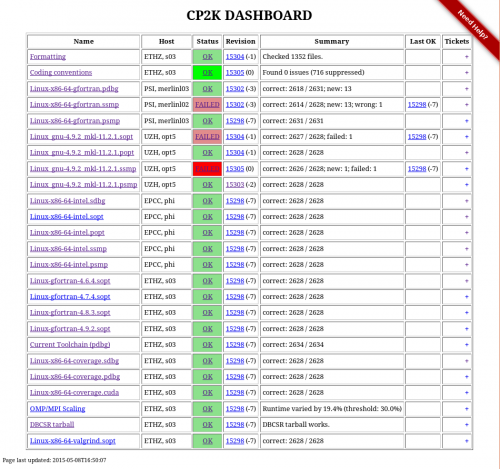
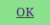
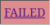

# CP2K Dashboard

[](https://dashboard.cp2k.org)

The CP2K dashboard is hosted at <https://dashboard.cp2k.org>. It is the central place where we
collect automatic test results.

## Main View

The main view shows the latest results from all testers. The table columns have the following
meaning:

| Column  | Meaning                                                             | Link Target            |
| ------- | ------------------------------------------------------------------- | ---------------------- |
| Name    | Display name of the tester.                                         | archive of old reports |
| Host    | Name of facility and computer which runs the test.                  |                        |
| Status  | Status from latest report. See [section below](#statuses).          | latest report          |
| Commit  | Git SHA from latest report, in parenthesis the backlog wrt. master. | Github commit browser  |
| Summary | Summary text from latest report.                                    |                        |
| Last OK | If the status is not OK, this show the last revision that was.      | Github commit browser  |

## Statuses

| Status                                        | Meaning                                                                                         |
| --------------------------------------------- | ----------------------------------------------------------------------------------------------- |
|                  | The latest commit passed the test.                                                              |
|          | The latest commit did **not** pass the test.                                                    |
|          | An older commit passed the test.                                                                |
|  | An older commit did **not** pass the test.                                                      |
|        | The dashboard was unable to fetch and parse the latest report.                                  |
|      | The results are outdated, a newer commit exists for over 24 hours and has not been tested, yet. |

## How does it work?

The HTML pages that make up the dashboard are generated by the script
[generate_dashboard.py](./generate_dashboard.py). It is run every 5 minutes by a
[cron-job](https://en.wikipedia.org/wiki/Cron).

For each tester it performs the following steps:

1. fetch latest report from `report_url`
1. parse report
1. if fetching and parsing was successful, make a copy of the report for the archive
1. if the test status is FAILED and the tester has notifications enabled, send emails to responsible
   author(s).

## Adding a Tester

To add a new tester to the dashboard, simply edit the [dashboard.conf](./dashboard.conf). The file
has the format of the python [configparser](https://docs.python.org/3/library/configparser.html). A
typical entry looks like this:

```
[mkrack-pdbg]
sortkey:     100
name:        Linux-x86-64-gfortran.pdbg
host:        PSI, merlinl03
notify:      off
report_url:  http://www.cp2k.org/static/regtest/trunk/Linux-x86-64-gfortran-regtest/pdbg/regtest-0
info_url:    http://www.cp2k.org/static/regtest/trunk/Linux-x86-64-gfortran-regtest/pdbg/index.html
```

The fields have the following meaning:

| Field        | Meaning                                                                                   |
| ------------ | ----------------------------------------------------------------------------------------- |
| `[foo_bar]`  | internal name of the tester, it shows up e.g. in the archive-url                          |
| `sortkey`    | used to order the entries in the dashboard, low means high up                             |
| `name`       | displayed in the first column of the dashboard                                            |
| `host`       | displayed in the second column of the dashboard                                           |
| `info_url`   | optional, if provided it is shows up as the "more information"-link on the archive-page   |
| `notify`     | on/off switch, determines if email notifications are send upon test failure. Default: On. |
| `timeout`    | Time period in hours it may take for a commit to be tested. Default: 24 hours.            |
| `report_url` | points to the location of the latest report                                               |

#### Report Format

A test report is a text file that contains the following three lines:

```
CommitSHA: <git-commit-sha>
...
more test output
this is ignored by the dashboard
...
Summary: <text>
Status: <OK/FAILED/UNKNOWN>
```

The output from a [regtest run](../regtesting) already contains the necessary lines.

## Bulk-Download of Archived Reports

Over time the dashboard archive has become quite a resource on its own. To allow for bulk-downloads
of the reports two url-lists are provided:

- A full list containing all reports in the archive:
  <http://dashboard.cp2k.org/archive/list_full.txt>
- A recent list containing only reports from the last 100 commits:
  <http://dashboard.cp2k.org/archive/list_recent.txt>

You can conveniently download all reports in a list with [wget](https://www.gnu.org/software/wget/):

```
$ wget -nH -Nxi http://dashboard.cp2k.org/archive/list_recent.txt
```

Added bonus: If you run the wget-command repeatedly, it'll only download the new reports.
